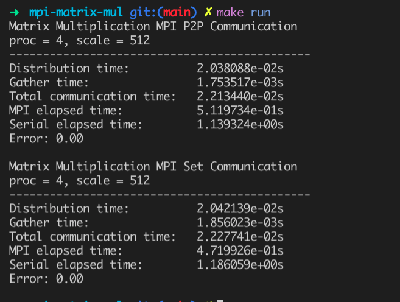

项目结构：

```
.
├── mpi-mat-mul
└── libsnow-mat-mul
```

- mpi-mat-mul 存放 MPI 矩阵乘法的代码
- libsnow-mat-mul 存放用于生成 libsnow-mat-mul.so 矩阵乘法运算库的代码

编译方法：

- mpi-mat-mul

  ```shell
  cd mpi-mat-mul
  mkdir build && mkdir bin
  make
  ```

- libsnow-mat-mul

  ```shell
  cd libsnow-mat-mul
  mkdir build && mkdir bin
  make
  ```

测试和运行方法：

- mpi-mat-mul

  ```shell
  make run
  ```

  执行后，会分别执行两个可执行文件，输入的矩阵规模为 512 x 512，进程数为 4。

  

  ```shell
  make test
  ```

  执行后，会对程序进行 benchmark 和数据收集，极其耗时。运行时间相关数据会输出到 `asset` 下。文件格式为 `<p2p/collect>_<scale>_<proc>`，p2p/collect 表示两种通信方式，scale 表示矩阵规模，proc 表示进程数。 

  我已经执行过 `make test`，可以直接执行 `make plot` 对数据进行处理并可视化，散点图同样保存在 `asset` 下。

- libsnow-mat-mul

  ```shell
  make test && make run
  ```

  执行后，Make 会默认编译 libsnow-mat-mul 根目录下的 test.cpp 文件，并动态链接 lib/libsnow-mat-mul.so，然后会执行编译好的 bin/test。

  test 中默认随机生成的矩阵规模是 4 x 4，你可以修改为更大的规模，或者构造别的测试样例。

