# Lab 2: MPI 矩阵乘法

|                                    |                         |
| :--------------------------------- | :---------------------- |
| **学号：19335109**                 | **课程：高性能计算**    |
| **姓名：李雪堃**                   | **学期：Fall 2021**     |
| **专业：计算机科学与技术（超算）** | **教师：黄聃、卢宇彤**  |
| **邮箱：i@xkun.me**                | **TAs：江嘉治、刘亚辉** |

---

***Table of Contents***

[toc]

---

## (一) 实验任务

- 分别采用 MPI 点对点通信和 MPI 集合通信实现矩阵乘法中的进程之间通信，并比较两种实现方式的性能。尝试用 mpi_type_create_struct
  聚合 MPI 进程内变量后通信。
- 将 Lab1 的矩阵乘法改造为一个标准的库函数 matrix_multiply（函数实现文件和函数头文件），输入参数为三个完整定义矩阵（A,B,C），
  定义方式没有具体要求，可以是二维矩阵，也可以是 struct 等。在 Linux系统中将此函数编译为.so 文件，由其他程序调用。

## (二) 实验环境

- CPU: Intel(R) Core(TM) i5-8250U CPU @ 1.60GHz
- OS: Ubuntu 20.04.2 LTS
- Compiler: gcc 9.3.0
- MPI: Open MPI 4.0.3
- Build System: GNU Make 4.2.1

## (三) 实验过程和核心代码

### (1) MPI 矩阵乘法

#### 1.1 点对点通信

代码在 `mpi_mat_mul` 下。

首先，我们用 C 实现了一个矩阵的库。代码在 `include/matrix.h` 和 `src/matrix.c` 下。

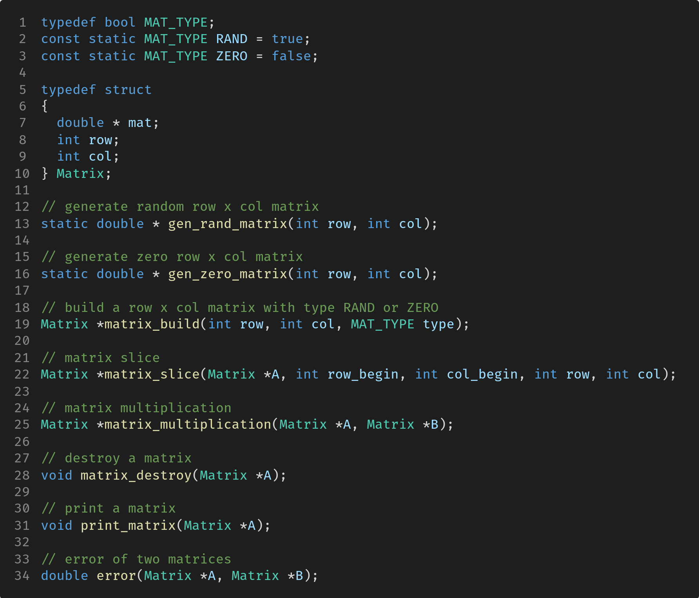

`MAT_TYPE` 用于确定生成的矩阵的类型是全 0 还是随机的。定义了一个结构体 `Matrix`，其中包含一个指向矩阵元素的指针，还有矩阵的行数和列数，采用一维数组存储二维矩阵，即 $A[i][j] = a[i * col + j]$ 的形式。

`matrix_build` 用于生成矩阵，其中会根据传递的参数 type 来确定生成的类型，进而选择调用 `gen_rand_matrix` 或 `gen_zero_matrix` 中的一个，来获得 mat 指针的值。

`matrix_slice` 用于将矩阵进行切片，会获得 `A[row_begin : row][col_begin : col]` 范围的矩阵。

`matrix_multiplication` 是朴素矩阵乘法，我们用一个函数实现。

`matrix_destroy` 用于销毁矩阵。`print_matrix` 用于打印矩阵。`error` 计算两个相同规模矩阵之间的元素绝对值之差的和。


考虑到 MPI 程序的性质，我们不方便在一个 main 函数中实现两种通信方式，因此分别编写两个包含 main 函数的源文件。代码在 `test/mpi_p2p.c` 和 `test/mpi_collect.c` 下。

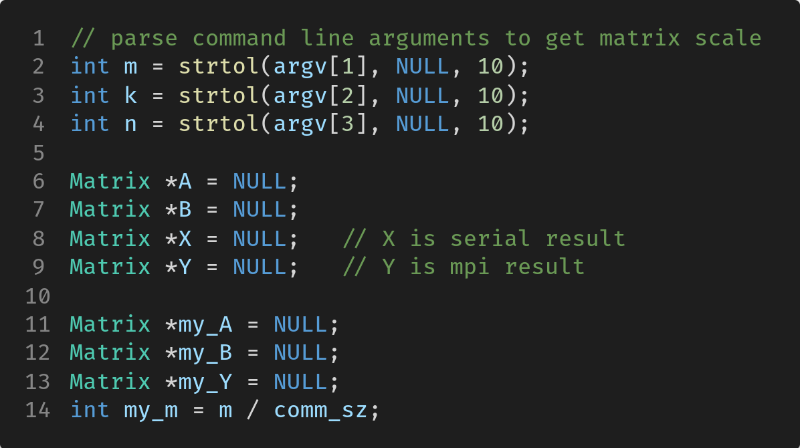

首先，我们从命令行传递表示矩阵规模的参数 m、k、n，用于作为后面 `matrix_build` 的参数。

其次，我们不仅会在 main 函数中实现 MPI 通信，而且会让 rank 0 的进程进行串行的朴素矩阵乘法，这样 MPI 通信和朴素矩阵乘法计算时采用的矩阵是相同的。

`my_A`、`my_B`、`my_Y` 都是各个进程自己的变量，分别表示接收到的部分的 A、B，以及计算的部分 C。`my_m` 是该进程需要计算的矩阵 A 的行数。

我没有想到特别好的通信方式，采用对 A 进行行划分的方式，B 不划分，因而每个进程接收到 A 的 my_m 行，接收整个矩阵 B，计算出 C 的 my_m 行，然后由 rank 0 矩阵进行汇总，生成矩阵 C。

MPI 点对点通信的数据分发部分：

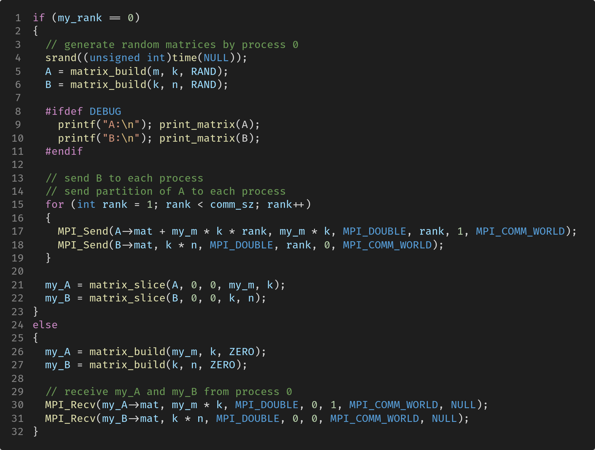

注意到，rank 0 进程如果仅仅将对应的 my_A 和 my_B 发送给其他进程，它自己是没有创建 my_A 和 my_B 的，所以我们在 21～22 行调用 `matrix_slice` 获得 rank 0 对应的 my_A 和 my_B。

在数据汇总之前，各个进程计算自己的 `my_Y`，这部分很简单，直接调用 `matrix_multiplication` 即可。

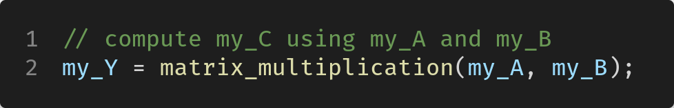

MPI 点对点通信的数据汇总部分：

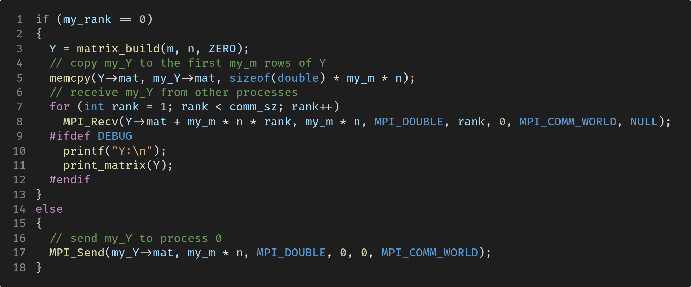

数据汇总时，非 rank 0 进程直接将 my_Y 发送给 rank 0 即可，rank 0 进程需要接收其他进程发送来的 my_Y，由于我们在分发数据时，rank 和 my_m 是对应的，所以接收时不用担心，按 rank 接收即可。注意到，rank 0 进程还要把自己的 my_Y 复制到 Y 的前 my_m 行。

#### 1.2 集合通信

集合通信的实现只要在点对点通信的基础上进行修改即可。

由于对 A 进行行的块划分，因此可以使用 `MPI_Scatter` 函数将 A 的各块散射到各个进程中；每个进程都需要得到 B 的一个副本，所以可以用 `MPI_Bcast` 函数进行广播。

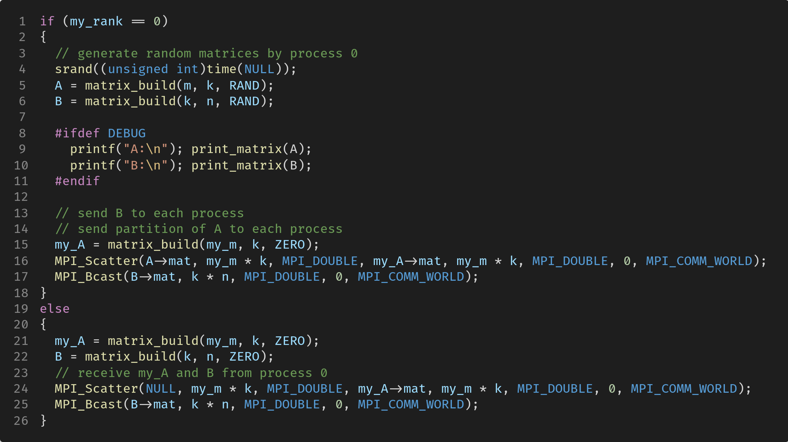

在汇总各个进程的 my_Y 时，使用 `MPI_Gather` 函数，它相当于 `MPI_Scatter` 逆操作，会按照进程的 rank 把数据放到 buffer 对应的位置，所以我们无需担心接收时顺序被打乱的问题。

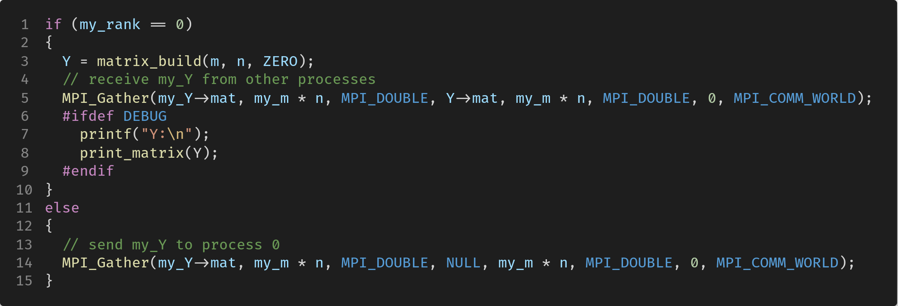

#### 1.3 计时

我们主要关注两种通信方式的耗时，不特意对矩阵计算的时间进行比较。

采取下面的方式统计一段 MPI 程序的耗时：

```C
double local_begin, local_end, local_elapsed, elapsed;
MPI_Barrier(MPI_COMM_WORLD);
local_begin = MPI_Wtime();
/* Code to be timed */
local_end = MPI_Wtime();
local_elapsed = local_end - local_begin;
MPI_Reduce(&local_elapsed, &elapsed, 1, MPI_DOUBLE, MPI_MAX, 0, MPI_COMM_WORLD);
```

无论是数据分发还是聚集，通信的时间应为从开始到最后一个进程离开的时间，即取决于最慢的进程。

通信子内的进程会在 `MPI_Barrier` 处挂起，只有当所有的进程都到达 `MPI_Barrier` 时，进程才会继续运行。`MPI_Wtime` 会返回墙上时钟时间，其中包括进程等待和阻塞的时间，而不仅仅是 CPU 时间。

我们将与上面类似的代码加在数据分发和聚集的代码前后即可，这里不再赘述，具体的代码请查看 `test/mpi_p2p.c` 和 `test/mpi_collect.c`。另外，我们在最后会让 rank 0 进程执行朴素矩阵乘，然后由 rank 0 打印下面的内容：

- 通信时间：包括两部分，数据分发时间、数据汇总时间
- MPI 耗时
- 串行耗时
- 矩阵计算的误差

此外，这些内容都会被输出到 `asset` 下的文件中，文件名为 `p2p_<scale>_<proc>` 或 `collect_<scale>_<proc>`，其中 scale 代表矩阵规模，proc 代表 MPI 进程数。

执行 `make run`，可以看到类似于下面的输出。

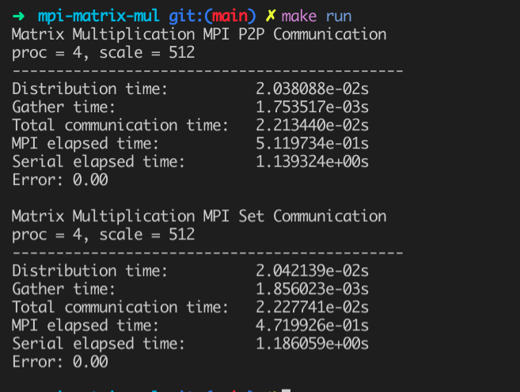

### (2) 构建自己的矩阵乘法共享库

代码在 `libsnow-mat-mul` 下。

`include/Matrix.h` 和 `src/Matrix.cpp` 是我在 lab1 中封装和实现的矩阵类，`include/Matrix_Mul.h` 和 `src/Matrix_Mul.cpp` 是我在 lab1 中实现的矩阵乘法，包括：

- 朴素矩阵乘法 `general_mat_mul`
- Strassen 算法的非递归版本 `strassen_mat_mul`
- 软件优化的矩阵乘法 `opt_mat_mul`

它们的输入参数都是两个 `Matrix` 对象 A 和 B，输出为 A 和 B 的乘积。

执行 `make`，即可生成共享库 `libsnow-mat-mul.so`，该共享库会存放在 `lib/` 下。关于编译和链接的参数，对于 gcc，编译时要加 `-fPIC` 参数，`f` 前缀表示 control the interface conventions used in code generation，表示 Position Independent Code，链接时要加 `-shared` 参数，表示生成 `.so` 的共享库。这些编译链接命令和参数可以在 Makefile 中看到。

```makefile
.PHONY: test
test: test.cpp
	$(CXX) test.cpp -o $(BIN_DIR)/test -I$(INC_DIR) -L$(shell pwd)/lib -Wl,-rpath=$(shell pwd)/lib -lsnow-matrix-mul

.PHONY: run
run:
	$(BIN_DIR)/test
```

在根目录下，默认可以编写一个 test.cpp 文件，执行 `make test` 会链接 `libsnow-mat-mul.so`，生成可执行文件，可以在 test.cpp 中使用 `Matrix` 类和上面 3 个矩阵乘法函数。执行 `make run`，即可运行该可执行文件。

默认提供的 test.cpp 文件如下：

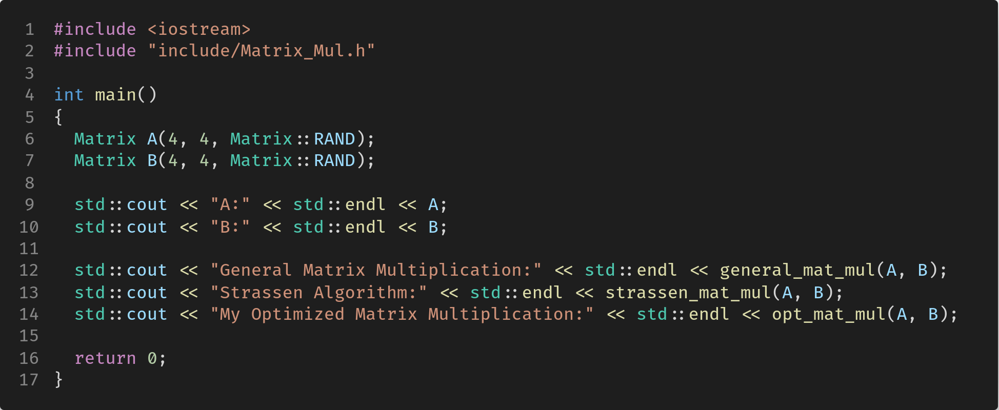

执行 `make run` 后，输出内容如下：

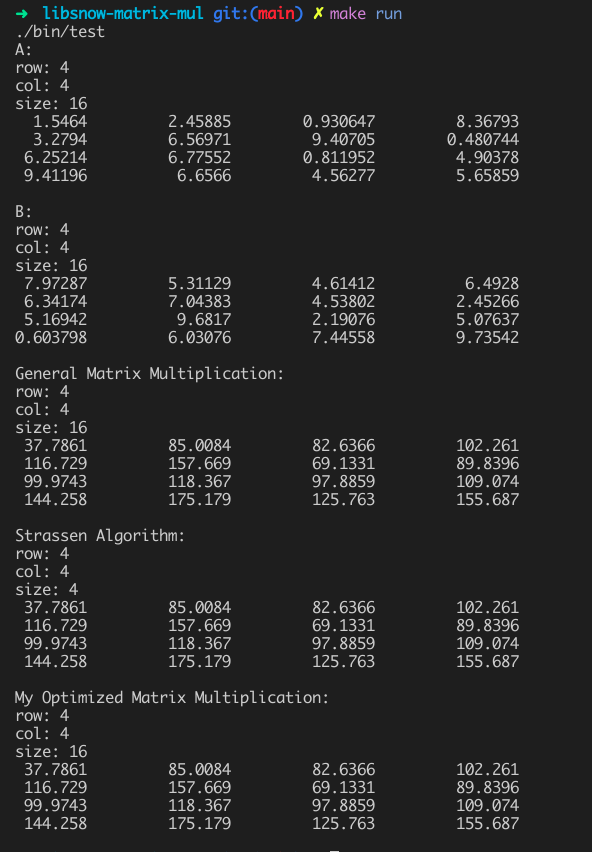

## (四) 实验结果

共享库的测试上面已经展示，下面展示 MPI 矩阵乘法的 benchmark。下面是 `make plot` 的结果，图片存放在 `asset` 下。无需执行 `make test`，==如果执行 `make test`，过程将极其耗时==。

我的 CPU 最多支持 4 个进程，因此 4 个进程以上的结果无法测试，如果使用 8 核CPU，可以修改 Makefile 中的参数。

- 红色：数据分发时间
- 橙色：数据聚集时间
- 黄色：通信总耗时
- 绿色：MPI 矩阵乘法总耗时
- 蓝色：串行矩阵乘法总耗时 

点对点通信：

- 1 process

  可以看到绿色和蓝色基本重合，而且通信时间随着矩阵规模增大变化比较小。

  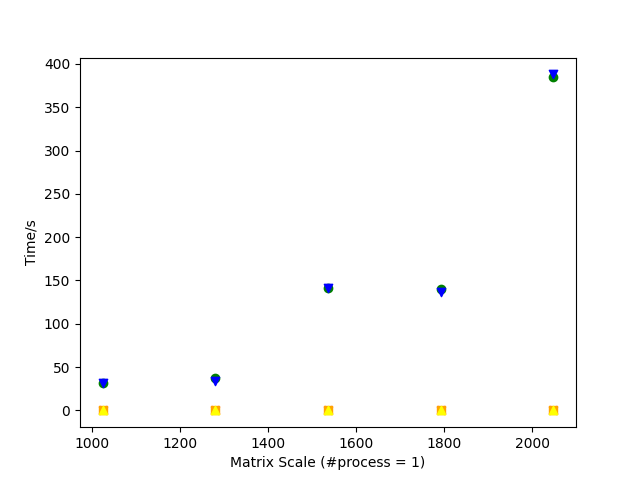

- 2 process

  绿色（即 MPI 耗时）大约是蓝色（即串行耗时）的 1 / 2，通信耗时同样比较小。

  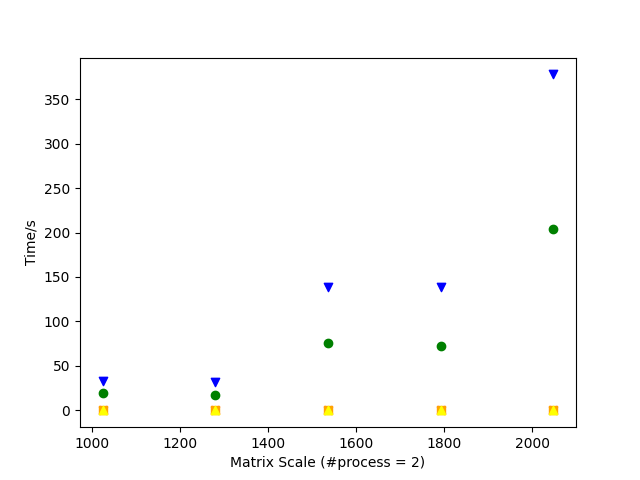

- 4 process

  绿色大约是蓝色的 1 / 3，而没有 1 / 4。

  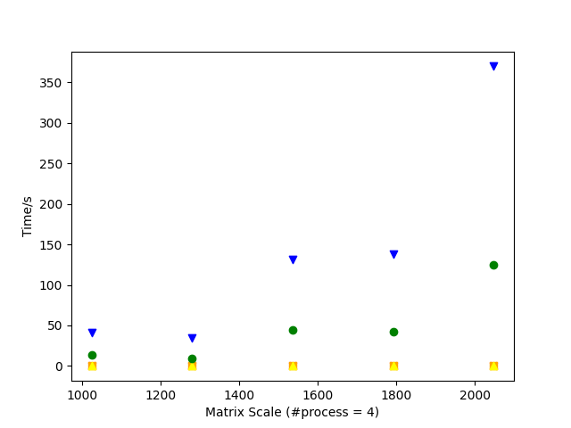

集合通信：

- 1 process

  蓝色和绿色基本重合。

  

- 2 process

  绿色大约是蓝色的 1 / 2。

  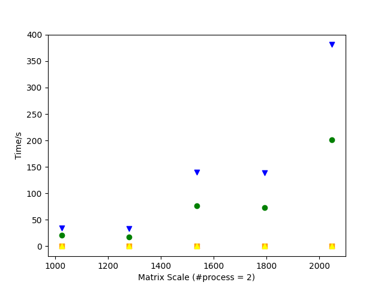

- 4 process

  绿色也大约是蓝色的 1 / 3，与点对点通信大致相同。

  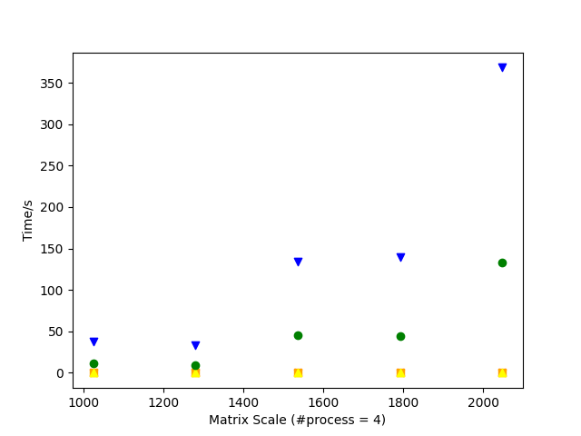

可以看到，点对点通信和集合通信的通信耗时区别不明显，原因主要是进程数很少，通信不是主要的时间开销，但可以通过查看具体的数据，集合通信还是比点对点通信的时间普遍要少的。如果在进程数较大时，可以预见集合通信开销要远小于点对点通信。

另外，总耗时上点对点通信与集合通信也差不多，主要原因是没有在通信开销上拉开差距。

## (五) 实验感想

通过这次实验，首先实现了 MPI 矩阵乘法，练习和使用了基本的 MPI 函数如 Send、Recv 还有集合通信函数，之前对集合通信函数地使用方法不太清楚，现在知道了所有的进程都要调用集合通信函数，里面是对 Send、Recv 的封装。可惜的是限于硬件资源，并不能很好地测试程序的性能。

其次，我构建了自己的共享库（动态链接库），编译时有些参数的位置很重要，不能随便乱放，否则很容易出现比如 undefined reference 的错误。掌握了共享库的运行原理和制作方法，并把自己的 `libsnow-mat-mu.so` 和相关头文件源文件写入了 Ubuntu 的文件系统，主要是放在 gcc、ld 的默认搜索目录下，可以在自己的电脑和系统上，直接编写源文件并链接，非常有趣。 

## 附录：参考资料

- https://www.open-mpi.org/faq/?category=mpi-apps
- https://stackoverflow.com/questions/9185792/passing-arguments-via-command-line-with-mpi
- https://stackoverflow.com/questions/14884126/build-so-file-from-c-file-using-gcc-command-line
- https://stackoverflow.com/questions/24526515/how-to-generate-a-so-file-from-multiple-source-files
- https://stackoverflow.com/questions/966960/what-does-fpic-mean-when-building-a-shared-library
- https://stackoverflow.com/questions/31176747/how-to-use-a-library-with-headers-and-so-files
- https://www.cprogramming.com/tutorial/shared-libraries-linux-gcc.html
