# Lab 3: Pthreads

|                                    |                         |
| :--------------------------------- | :---------------------- |
| **学号：19335109**                 | **课程：高性能计算**    |
| **姓名：李雪堃**                   | **学期：Fall 2021**     |
| **专业：计算机科学与技术（超算）** | **教师：黄聃、卢宇彤**  |
| **邮箱：i@xkun.me**                | **TAs：江嘉治、刘亚辉** |

---

***Table of Contents***

[toc]

---

## (一) 实验任务

- 分别构造MPI版本的标准矩阵乘法和优化后矩阵乘法的加速比和并行效率表格。并分类讨论两种矩阵乘法分别在强扩展和弱扩展情况下的扩展性。
- 通过 Pthreads 实现通用矩阵乘法的并行版本，Pthreads并行线程从1增加至8，矩阵规模从512增加至2048。
- 编写使用多个进程/线程对数组 a[1000] 求和。
- 编写一个多线程程序来求解二次方程组 $𝑎𝑥^2+𝑏𝑥+𝑐=0$ 的根，中间值被不同的线程计算，使用条件变量来识别何时所有的线程都完成了计算。
- 使用 Monte-Carlo 方法估算 $y=x^2$ 曲线与 x 轴之间区域的面积，其中 x 的范围为 [0,1]。

## (二) 实验环境

- CPU: Intel(R) Core(TM) i5-8250U CPU @ 1.60GHz
- OS: Ubuntu 20.04.3 LTS
- Compiler: gcc 9.3.0
- Build System: GNU Make 4.2.1

## (三) 实验过程和核心代码

### (1) 构造 MPI 版本矩阵乘法加速比和并行效率表

朴素矩阵乘法：

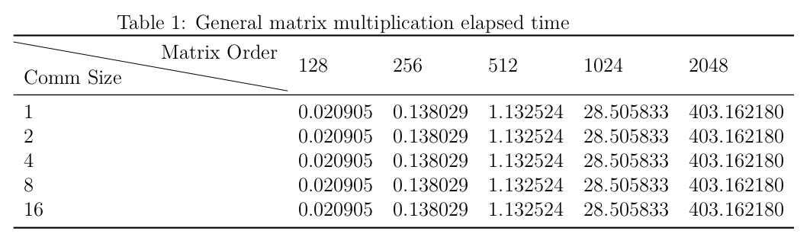

Lab1 中软件优化的版本：

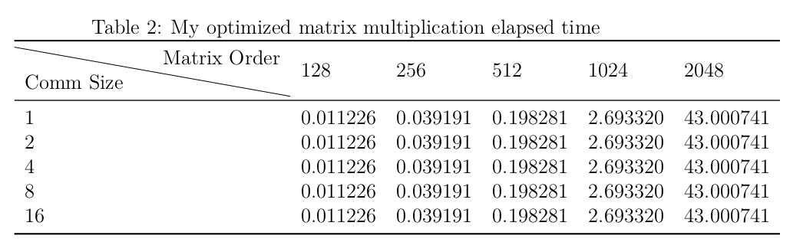

MPI 点对点通信版本：

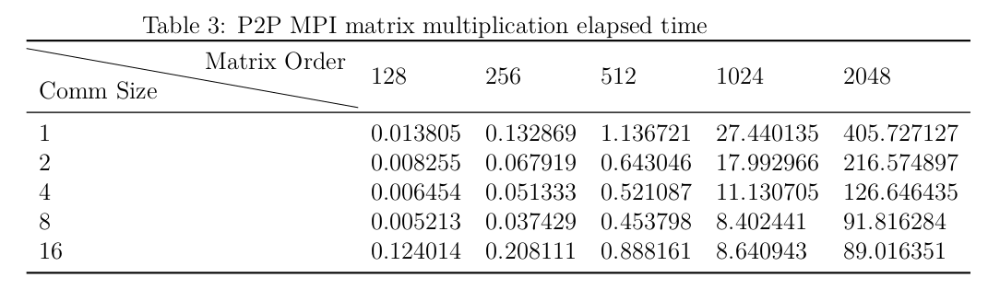

MPI 集合通信版本：

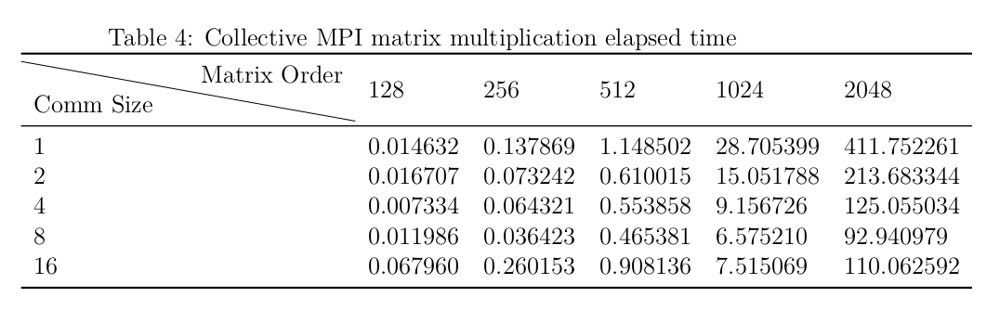

由于普通矩阵乘法和软件优化版本并不需要多个进程来执行，所以上表中这两者的运行时间只和矩阵规模有关。

我们粗略观察各个版本的耗时，发现 MPI 点对点通信和MPI集合通信的耗时几乎相当，在矩阵规模更大时（1024、2048），集合通信比点对点通信耗时略少几秒。这一方面是我们在单块 CPU 上进行通信导致的，所以通信延迟很低；另一方面受物理核数的限制，集合通信的优势无法明显地体现出来。如果我们将程序移植到一个较大的集群上，拥有众多的 CPU 和核数，且各节点之间有一定延迟，那么集合通信肯定比点对点通信耗时要少很多。

由于我的 CPU 物理核数是 4，下面加速比和效率都是取 4 个进程并行的耗时来计算的。

|         加速比          |          并行效率          |
| :---------------------: | :------------------------: |
| 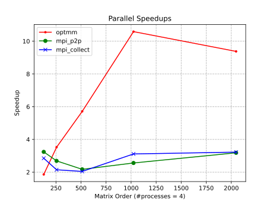 | 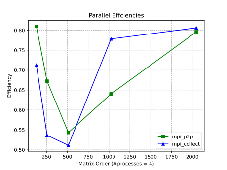 |

可以看到，软件优化版本的矩阵乘法的加速比远比 MPI 版本要高，而 MPI 的两种版本加速比大约相等。

对于并行效率，MPI 的两个版本也体现出相似的增长模式，可以看到在矩阵规模较小时（<500），矩阵规模的增大会引起效率的减少，推测是因为进程创建和销毁的开销对总耗时的影响大于并行带来的收益而导致的；而在矩阵规模较大时（>500），矩阵规模增大伴随着效率的增加，原因则与前者相反。

### (2) 通过 Pthreads 实现通用矩阵乘法

Pthread 矩阵乘法采取对矩阵 A 的行划分，如果进行块划分应该可以获得更高的性能，但块划分对矩阵的 size 有一定要求，编码上困难很多。我采用 C++ 编程，沿用前两次实验的 `Matrix` 类。

下面的代码在 `pthread-mat-mul/include/matrix_mul.h` 和 `pthread-mat-mul/src/matrix_mul.cpp` 下。

首先定义关于 Pthread 矩阵乘的 API，`pthread_mat_mul` 接收 3 个参数：矩阵 `A`、矩阵 `B`、线程数 `thread_count`，返回一个矩阵对象 `C`。

在函数的内部，调用 `pthread_mat_mul_kernel` 函数，可以看到这个函数的参数包括了存储矩阵的指针、行数和列数、线程数，实际上这个 kernel 函数基本上用 C 实现的，直接利用指针对数据进行修改，没用到 C++ 的语法和特性，这样可以获得高的性能，很多 C++ 和 C 兼容的项目都采用这样的方法。

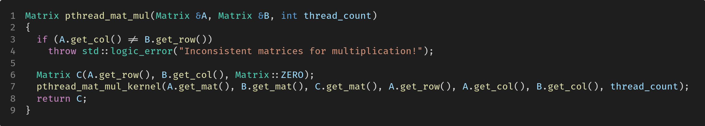

在 `pthread_mat_mul_kernel` 函数中，首先为存储线程信息的 `thread_handles` 分配 `thread_count` 个空间，为线程参数 `thread_args` 分配同样多的空间。`thread_arg` 是一个我们自己定义的结构体类型，用于向线程传递必要的参数。

在 6 ～ 17 行，为各个线程设置好参数，包括指向矩阵的指针、矩阵的行数和列数、线程数、线程号。

接下来就创建线程，各个线程执行线程函数，最后线程合并。

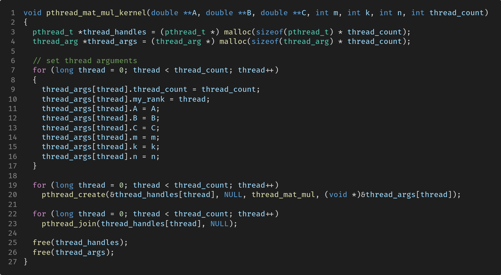

线程函数 `thread_mat_mul` 接收线程参数，然后首先初始化自己要计算的起始行和结束行。注意到 `my_first_i` 和 `my_last_i` 的计算中考虑到 `m` 不能被 `thread_count` 整除的情况，这种情况下只要将最后一个线程的 `my_last_i` 设置为 `m` 即可。

设置好后，就可以计算矩阵 C 的 `my_first_i` 到 `my_last_i` 行的元素了。

在 `pthread-mat-mul` 下执行 `make && make test && make plot`，可以得到 `pthread-mat-mul/asset/performance-8.svg` 图像。我的 CPU 支持 8 线程，所以按线程数等于 8 的情况，矩阵规模按 512、1024、1536、2048 增长，可以看到在矩阵规模是 2048 时，pthread 耗时大约是串行的 1 / 5，与理想的加速比相差不少。

一个改进的办法是，在线程函数 `thread_mat_mul` 中使用我们软件优化版本的矩阵乘法，这样性能预计可以获得巨大提升。

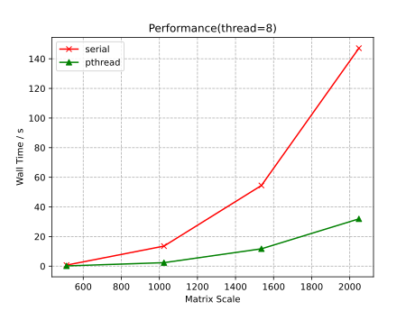

### (3) 基于 Pthreads 的数组求和

代码在 `pthread-array-sum` 下。

首先是线程逐个提取数组 `a` 中的元素并求和。关于创建合并线程的代码过于公式化，这里不展示了，关键的部分在于线程函数。

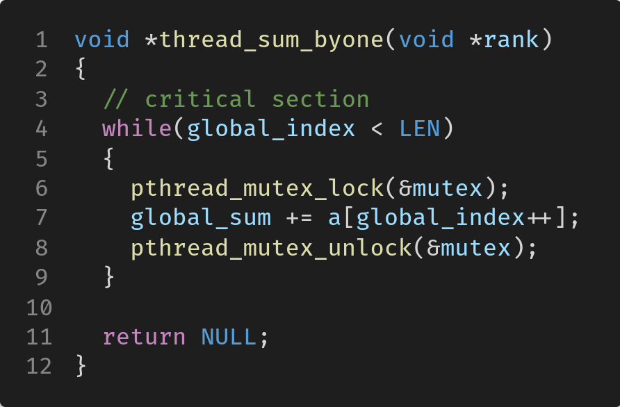

我们将数组 `a` 定义为全局数组，`global_index` 定义为全局索引，`global_sum` 则是数组 `a` 的元素之和。这三者都可以被所有的线程访问和修改。

`thread_sum_byone` 不需要接收任何参数。在逐个提取数组 `a` 的元素时，有两个竞争条件：一是 `global_index` 需要递增，如果不对 `global_index` 更新加锁的话，其他线程就可能对 `global_index` 的读取或存入进行竞争，导致重复读取某个元素；二是 `global_sum` 明显需要加锁，否则存在同样的问题，导致最后的 `global_sum` 结果偏小。

鉴于此，我们可以将整个代码加锁，这样就只需要一个锁 `mutex`，定义为全局的即可。但如此做有一个致命的问题，加锁之后，线程对 `a` 的读取和求和不是异步的，退化成串行读取加和了，时间上一定比串行还要慢。

于是我们可以采用一次读取多个下标的方法。将读取和加和分开，用 `local_sum` 存储部分求和的结果，最后将 `local_sum` 加到 `global_sum` 上。

定义两个互斥锁 `mutex_index` 和 `mutex_sum`，分别对 `global_index` 和 `global_sum` 加锁，线程定义 `local_begin` 和 `local_end` 用于指示本次需要读取的索引范围，定义 `local_sum` 变量用于存储本次读取的 10 个值的和。

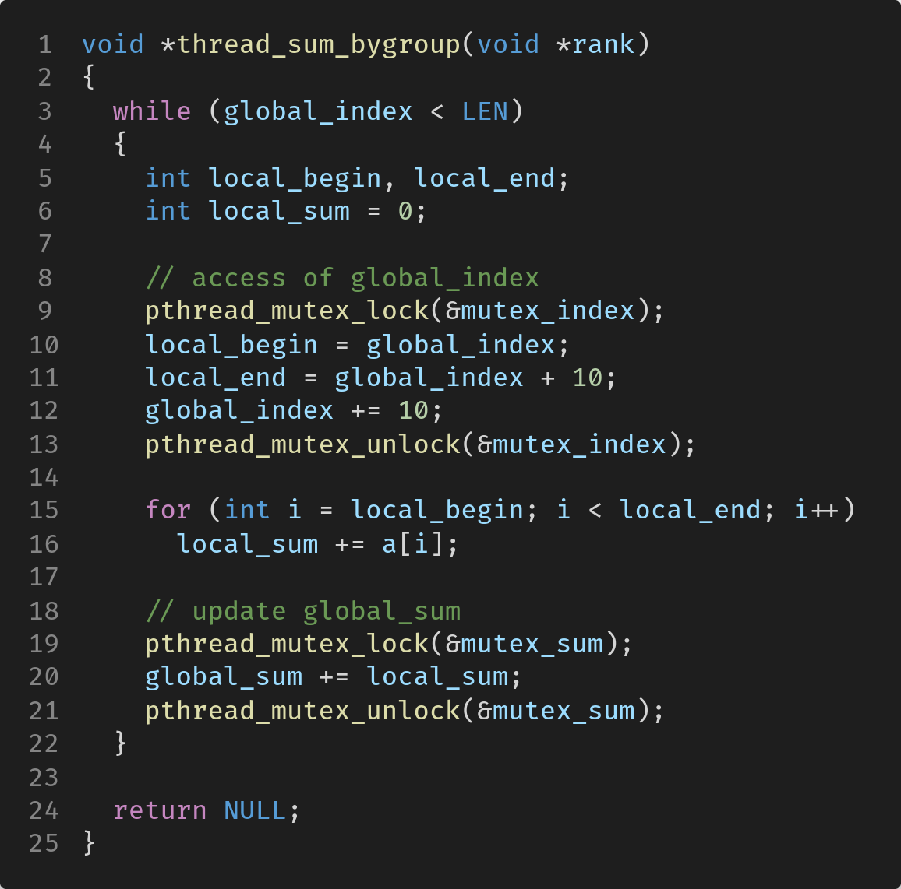

为了测试性能，我们定义一个 `GET_WALL_TIME` 的宏，用于获取程序运行时的墙上时间。

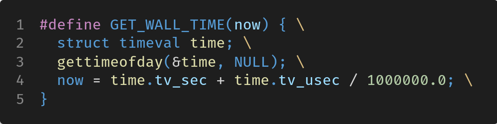

设置线程数为 8，串行读取求和、并行逐个读取求和、并行 10 个一组读取求和的运行时间如下（数组长度是 1000）。

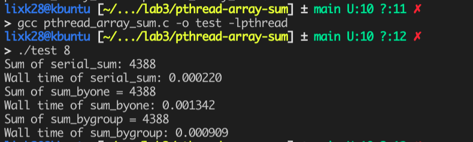

可以看到，结果与预期相同，虽然计算结果相同，但串行耗时 0.22 ms，而并行逐个的方法耗时 1.342 ms，比串行慢不少。并行分组的方法耗时 0.909 ms，也比串行慢，是由数组长度太小、线程开销和忙等待的时间导致的。

### (4) Pthreads 求解二次方程的根

代码在 `pthread-root` 下。

我们使用两个线程计算方程的根，一个线程计算 $\Delta = b^2 - 4ac$ 的值，计算好后用条件变量唤醒另一个线程，另一个线程根据计算好的 `delta` 来计算两个根。（假设给出的 a、b、c 使方程有解，且保证方程是二次的）

下面分别是两个线程函数 `compute_delta` 和 `compute_root`，`a`、`b`、`c`、`delta`、`root1` 和 `root2` 都定义为全局变量，`flag` 也是全局变量，作为线程唤醒或阻塞的条件。当 `delta` 计算好后 `flag`设为 `true`，然后唤醒计算根的线程。

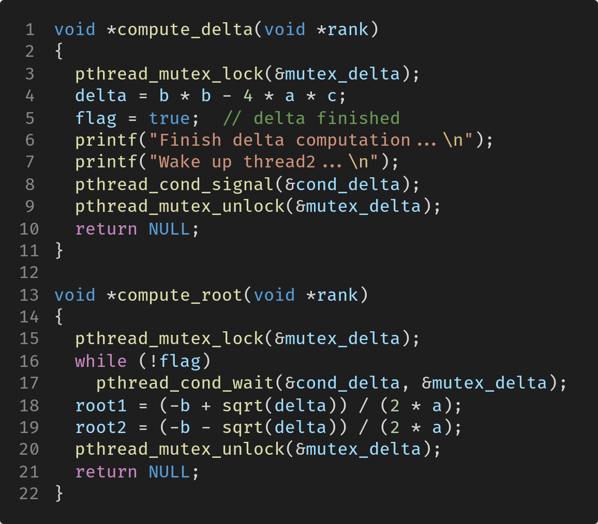

`main` 函数中是创建合并线程、初始化销毁互斥锁的过程，这里不再赘述。编译运行的结果如下。

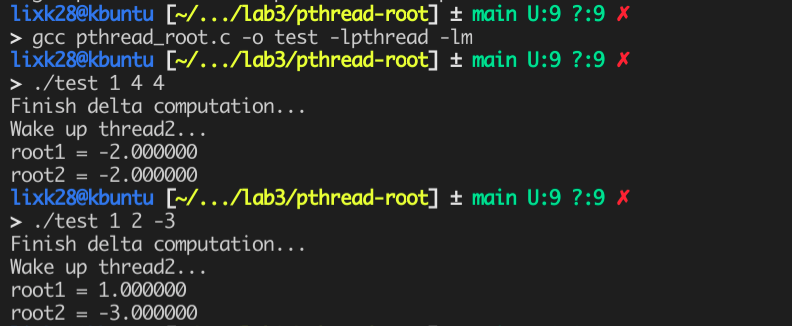

### (5) Monte-Carlo 方法估计积分值

代码在 `pthread-integral` 下。

首先，积分值应为 $\displaystyle\int_0^1x^2dx = \frac{1}{3} \approx 0.333$。Monte-Carlo 方法是一种基于概率模拟的方法，积分应为下图中绿色区域的面积，我们将它看成包含在一个 1x1 的正方形中，向这个正方形中随机地 "撒豆子"，那么显然落在绿色区域中的概率就是它的面积。

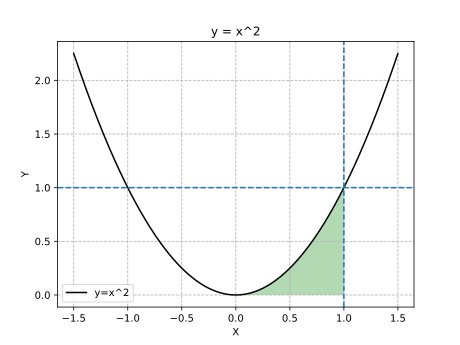

因此，我们可以随机地生成范围在 [0, 1] 中的 x 和 y，如果 (x, y) 落在绿色区域中，说明命中，将命中次数加一，否则命中次数不变，最后将命中次数除以总的模拟次数就可以得到近似的落在绿色区域的概率，即绿色区域的面积。
$$
\displaystyle\int_0^1x^2dx \approx \frac{number_{hit}}{number_{toss}}
$$
考虑到需要用多线程模拟，我们可以将 `number_toss` 定义为全局变量，表示投掷的总次数。每个线程用 `my_number_toss` 表示自己需要投掷的次数。判断随机生成的 (x, y) 是否在绿色区域只需要判断 $x^2 > y$ 是否成立，成立则将自己的命中次数 `my_number_hit` 加一。最后，需要用互斥锁保护更新总的命中次数 `number_hit` 的临界区。

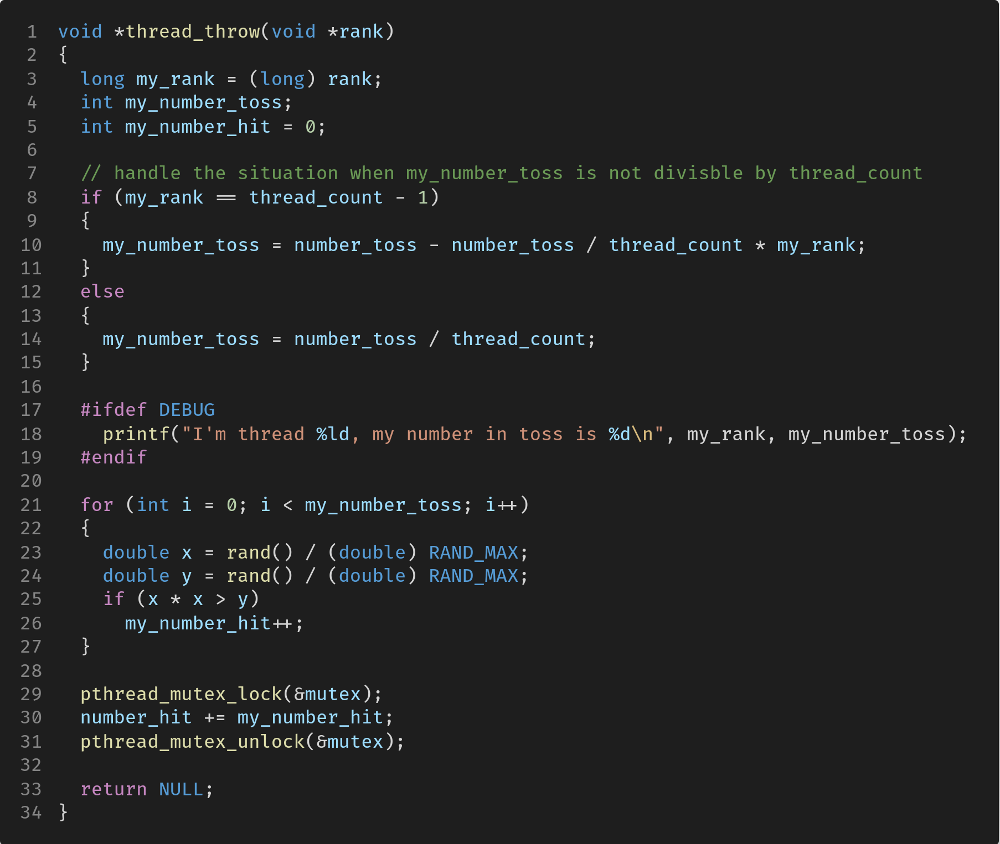

创建销毁线程等代码不作说明，编译运行的结果如下。设置线程数为 8，可以看到，随着投掷次数的增加，结果越来越精确。误差大约在 0.001 左右。

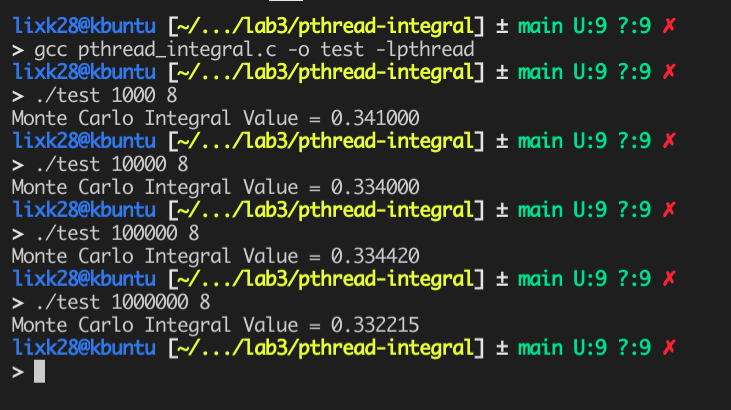

## (四) 实验结果

实验结果在上面每步已经展示。

## (五) 实验感想

本次实验做了几个关于 pthread 的编程练习，pthread 编程比 mpi 要稍简单些，但 mpi 在 HPC 领域还是占据统治地位，主要原因之一就依赖于它的进程间通信和分布式内存的特点。pthread 矩阵乘法还可以将线程函数中的矩阵乘替换为我们自己优化的矩阵乘法，这样两者综合起来可以获得很高的性能，我想之后有时间可以做一下。

其余几个问题并不难，关键在于临界区的加锁和保护，对于操作系统的原理和概念也是很好的复习。

另外，条件变量这块我一直没有弄太懂，对于信号量和条件变量的区别一直很困惑，感觉它们的使用方法颇为相似。而互斥量我确实知道与前两者有很大的不同。希望之后有时间能查查资料，仔细琢磨、深入理解它们的区别和联系。

## 附录：参考资料

- https://en.wikipedia.org/wiki/Monte_Carlo_method#Monte_Carlo_and_random_numbers
- https://en.wikipedia.org/wiki/Monte_Carlo_integration
- https://stackoverflow.com/questions/17432502/how-can-i-measure-cpu-time-and-wall-clock-time-on-both-linux-windows