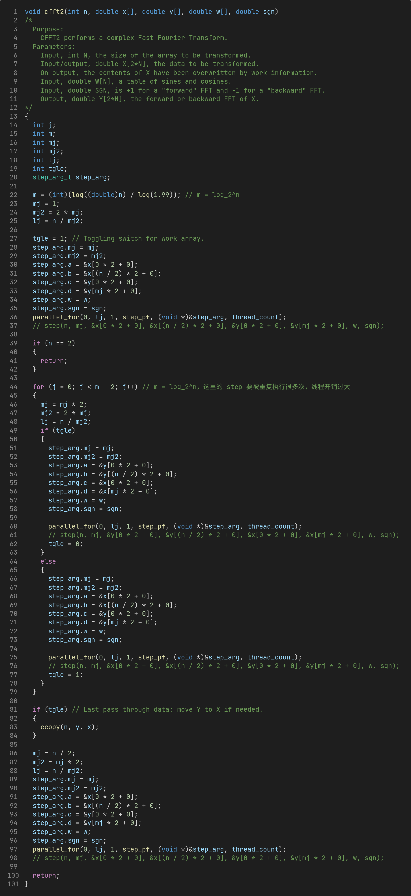

# Lab 5: fft 和 headted plate 的并行化

|                                |                     |
| :----------------------------- | :------------------ |
| 学号：19335109                 | 课程：高性能计算    |
| 姓名：李雪堃                   | 学期：Fall 2021     |
| 专业：计算机科学与技术（超算） | 教师：黄聃、卢宇彤  |
| 邮箱：i@xkun.me                | TAs：江嘉治、刘亚辉 |

---

***Table of Contents***

[toc]

---

## (一) 实验任务

- 任务 1：
  - 通过实验 4 构造的基于 Pthreads 的 `parallel_for` 函数替
    换 fft_serial 应用中的某些计算量较大的 for 循环,
    实现 for 循环分解、分配和线程并行执行。

- 任务 2：
  - 将 fft_serial 应用改造成基于 MPI 的进程并行应用
    （为了适合 MPI 的消息机制，可能需要对 fft_serial
    的代码实现做一定调整）。
  - 将 heated_plate_openmp 应用改造成基于 MPI 的进程并行应用。
  - Bonus：使用 `MPI_Pack`/`MPI_Unpack`，或
    `MPI_Type_create_struct` 实现数据重组后的消息传递。
- 任务 3：
  - 性能分析任务 1 和并行化 fft 应用，包括：
    - 不同问题规模的并行化 fft 应用并行执行时间对比，
      其中问题规模定义为 N 变化范围 2， 4， 6， 8， 16， 32，
      64，128，……， 2097152；并行规模为 1，2，4，8 进程/线程。
    - 内存消耗对比，内存消耗采用 `valgrind massif` 工具采集，注意命令 valgrind 命令中增加 `--stacks=yes`
      参数采集程序运行栈内内存消耗。

## (二) 实验环境

- Ubuntu 20.04.3 LTS x86_64
- gcc 9.3.0
- OpenMPI 4.0.3
- GNU Make 4.2.1
- valgrind 3.15.0

## (三) 实验过程和核心代码

### (1) parallel_for 并行化 fft

代码在 `fft/fft-pf` 目录下。其中 `parallel_for.h` 和 `parallel_for.c` 是上次实验基于 pthreads 的 `parallel_for` 函数。上次写的有些 bug，这次进行了修复和改进。

首先是 `parallel_for` 的内部参数 `pf_arg_t`，这个参数不需要用户指定，是在 `parallel_for` 函数内部传递给各个线程的参数。`pf_arg_t` 中的 `fun_arg` 才是用户自定义的结构体参数，`parallel_for` 中的 `void *arg` 参数传递的就是用户自定义的结构体。

在 `parallel_for` 函数中，首先计算总的循环次数 `loop_count`，然后判断 `loop_count` 是否小于等于线程数 `thread_count`，如果是则只开启一个线程，相当于串行计算，这样做是为了不损失性能。

接着是初始化线程函数的参数，将 `pf_arg_t` 中的 `func_arg` 指针指向用户传递来的参数结构体指针。最后是线程创建和销毁。

在 fft_serial 中，经过观察分析，发现 `cffti` 和 `step` 函数可以并行，并且测试后的确带来了性能的提升；`ccopy` 也可以并行，但并行后性能反而下降。

首先是 `cffti`，它的作用是准备 FFT 计算时需要的 sin 和 cos 表。首先创建参数结构体 `cffti_arg_t`，然后编写 `cffti_pf` 函数，从 `pf_arg_t` 中获得 `my_start`、`my_end` 和 `my_increment`，以及用户传递的参数结构体。然后获取这些参数，用一个循环进行计算即可。

在 `cffti` 函数中，将原有的循环替换为 `parallel_for` 即可。

然后是 `step` 函数的并行，该函数作用是执行 FFT 中的一次迭代。同样地，我们需要创建 `step_arg_t` 参数结构体。然后编写 `step_pf` 函数，解析参数，执行循环。

`step` 函数在 `cfft2` 函数中被调用，我们将其中的 `step` 函数全部替换为 `parallel_for` 函数，开启线程执行 `step_pf`。

### (2) heated_plate_openmp 改造为基于 MPI 的进程并行应用

heated plate 是个数值计算问题，主要是通过迭代来计算 plate 上温度收敛状态的分布。

一个 plate 用一个 MxN 的矩形区域来表示，程序中设置 M = N = 500，开始时每个节点都赋予一个初始的温度，程序中设置左边界、右边界和下边界的温度都为 100，上边界的温度为 0，中间位置的温度是边界温度的均值（所有边界节点温度的和除以边界节点数）。这个过程是初始化的过程，不好并行，我因此用 master 进程来初始化，在 master 进程中使用 openmp 并行。

迭代的过程非常简单，对面中间位置的节点（不在边界的节点），每轮更新它的温度为其相邻节点温度的均值（上下左右四个节点），即：
$$
w[center] = \frac{w[north] + w[south] + w[east] + w[west]}{4}
$$
一直进行下去，直到相对误差（上次迭代结果与本次迭代结果相比）小于一个阈值，误差的计算是采取所有节点中误差最大值作为本次迭代的误差。

首先是 master 进程（rank 0）初始化 plate。内部用 openmp 并行加快速度。比较简单，这里不再赘述。

然后，每个进程计算自己需要计算的范围，这里是按行划分的。注意到，第 0 行和第 M-1 行是不需要计算的，因为它们属于边界节点，温度是固定的。

`my_bound` 函数会根据 `start`、`end`、进程数 `comm_sz` 和进程号 `my_rank` 来计算该进程需要计算的范围。可以处理不能被整除的情况。

### (3) fft_pf 和 fft_openmp 的性能对比

## (四) 实验结果

## (五) 实验感想

## 附录：参考资料

- 

DFT:
$$
\displaystyle Y[p] = \sum_{k=0}^{n-1}X[k]w^{kp}, \quad \displaystyle w = e^\frac{2\pi i}{n}
$$
FFT:

$w = e^\frac{2\pi i}{n} = cos\frac{2\pi}{n} + isin\frac{2\pi}{n}$
$$
\begin{align}
Y[p] &= \sum_{k=0}^{n/2-1}X[2k]w^{2kp} + \sum_{k=0}^{n/2-1}X[2k+1]w^{(2k+1)p} \quad (even + odd) \\
&= \sum_{k=0}^{n/2-1}X[2k]w^{2kp} + \sum_{k=0}^{n/2-1}X[2k+1]w^pw^{2kp} \\
&= \sum_{k=0}^{n/2-1}X[2k]\hat{w}^{kp} + w^p\sum_{k=0}^{n/2-1}X[2k+1]\hat{w}^{kp} \quad (\hat{w} = e^{2\pi i/(n/2) \times kp} = w^2) \\
\end{align}
$$
