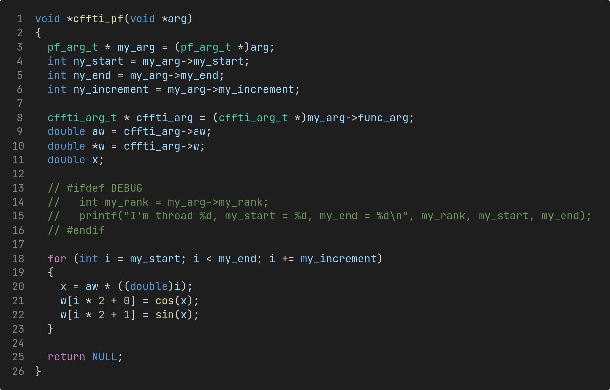
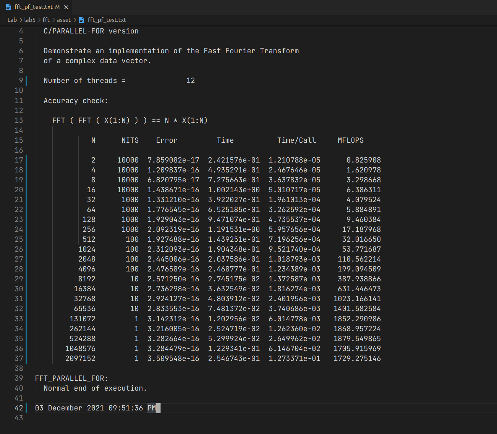
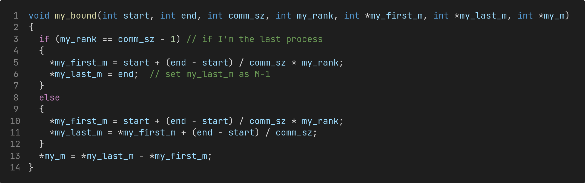
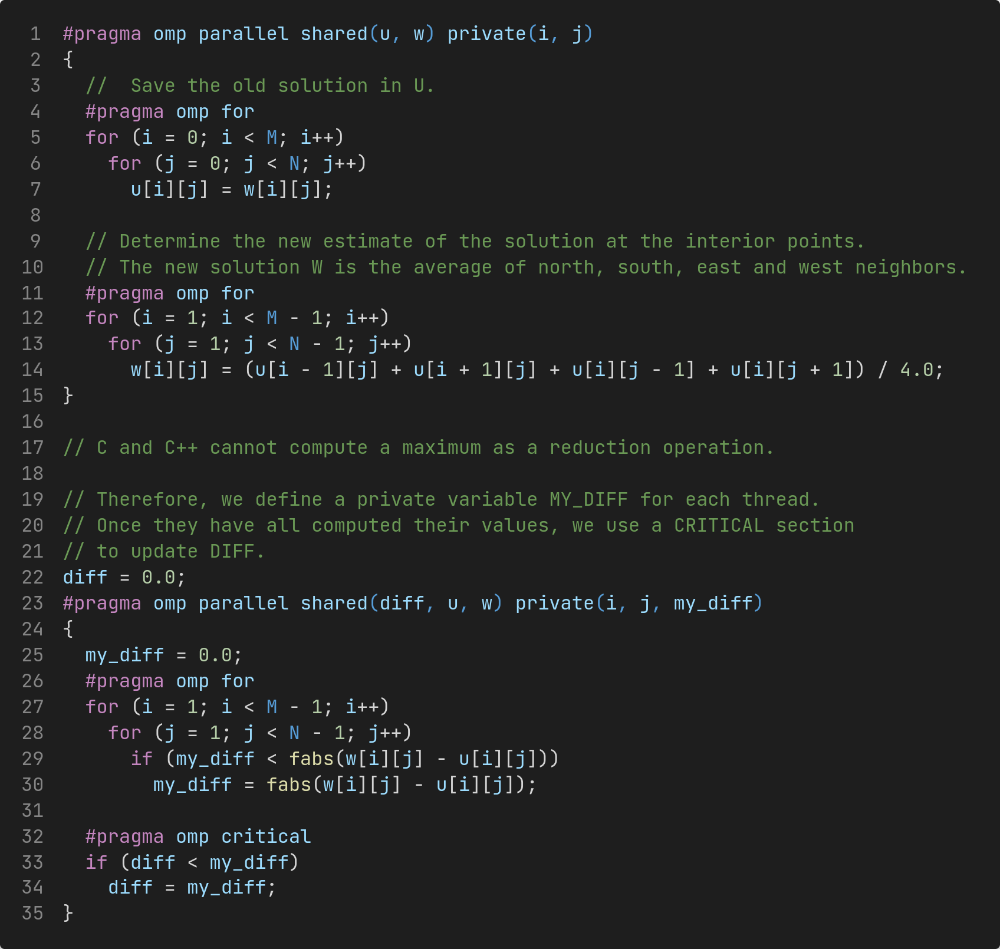
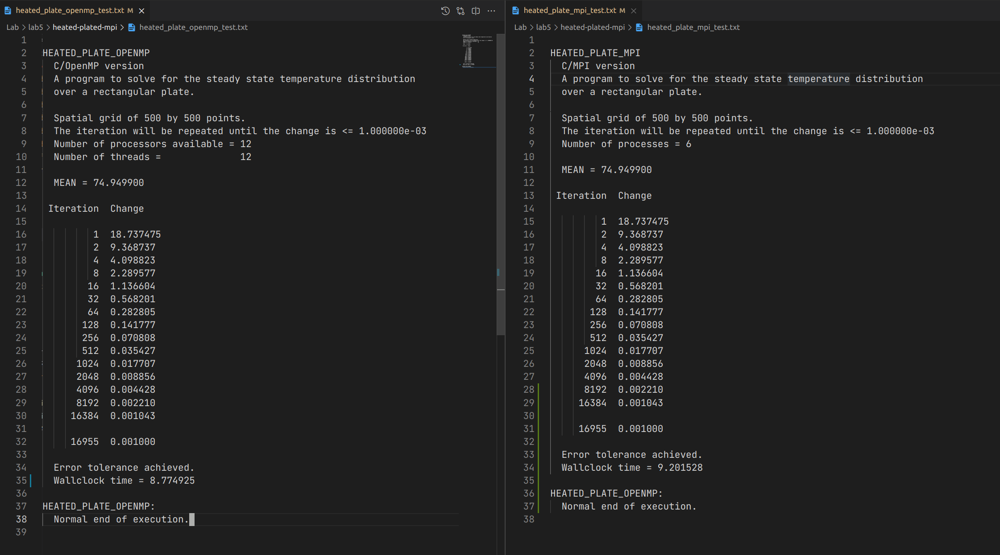
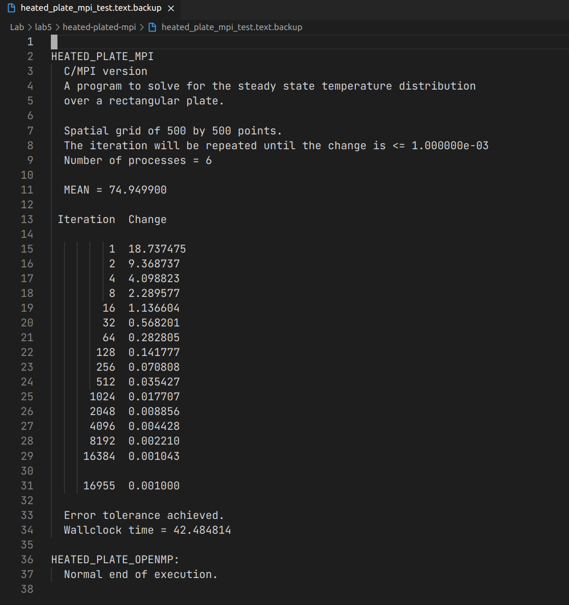
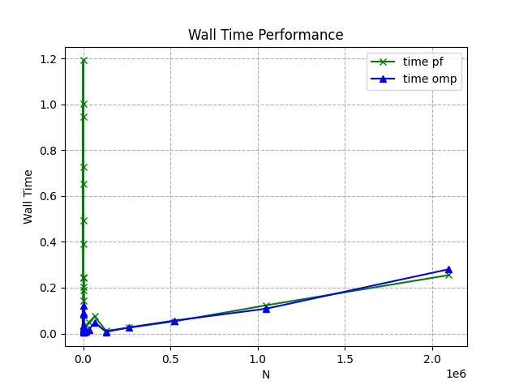
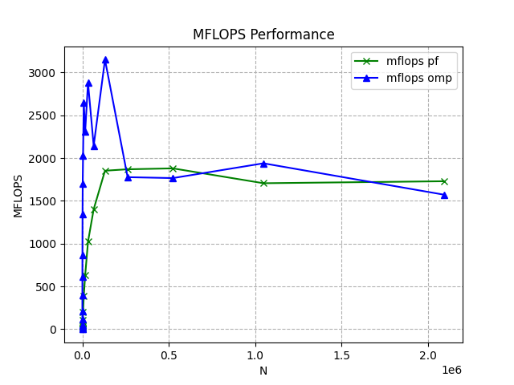
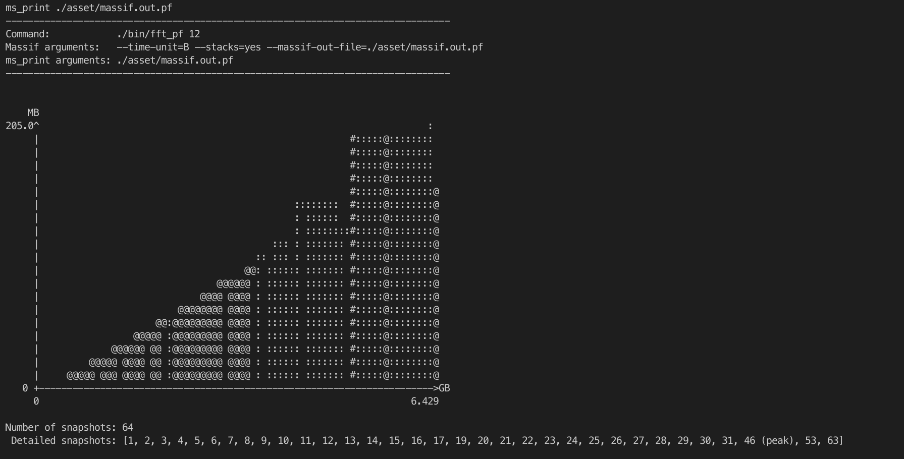
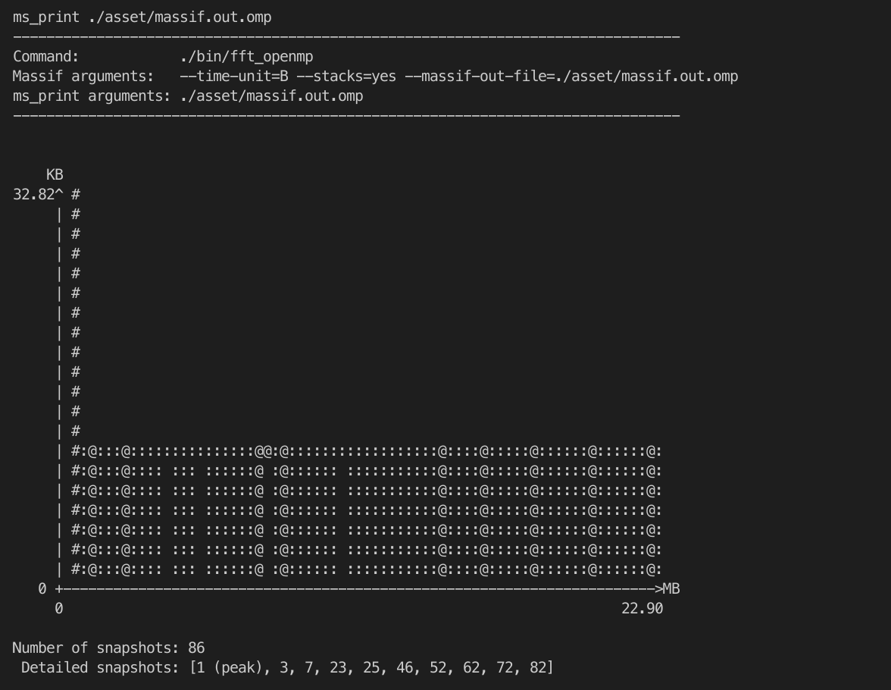

# Lab 5: fft 和 headted plate 的并行化

|                                |                     |
| :----------------------------- | :------------------ |
| 学号：19335109                 | 课程：高性能计算    |
| 姓名：李雪堃                   | 学期：Fall 2021     |
| 专业：计算机科学与技术（超算） | 教师：黄聃、卢宇彤  |
| 邮箱：i@xkun.me                | TAs：江嘉治、刘亚辉 |

---

***Table of Contents***

[toc]

---

## (一) 实验任务

- 任务 1：
  - 通过实验 4 构造的基于 Pthreads 的 `parallel_for` 函数替
    换 fft_serial 应用中的某些计算量较大的 for 循环,
    实现 for 循环分解、分配和线程并行执行。

- 任务 2：
  - 将 fft_serial 应用改造成基于 MPI 的进程并行应用
    （为了适合 MPI 的消息机制，可能需要对 fft_serial
    的代码实现做一定调整）。
  - 将 heated_plate_openmp 应用改造成基于 MPI 的进程并行应用。
  - Bonus：使用 `MPI_Pack`/`MPI_Unpack`，或
    `MPI_Type_create_struct` 实现数据重组后的消息传递。
- 任务 3：
  - 性能分析任务 1 和并行化 fft 应用，包括：
    - 不同问题规模的并行化 fft 应用并行执行时间对比，
      其中问题规模定义为 N 变化范围 2， 4， 6， 8， 16， 32，
      64，128，……， 2097152；并行规模为 1，2，4，8 进程/线程。
    - 内存消耗对比，内存消耗采用 `valgrind massif` 工具采集，注意命令 valgrind 命令中增加 `--stacks=yes`
      参数采集程序运行栈内内存消耗。

## (二) 实验环境

- Ubuntu 20.04.3 LTS x86_64
- gcc 9.3.0
- OpenMPI 4.0.3
- GNU Make 4.2.1
- valgrind 3.15.0

## (三) 实验过程和核心代码

### (1) parallel_for 并行化 fft

代码在 `fft/fft-pf` 目录下。其中 `parallel_for.h` 和 `parallel_for.c` 是上次实验基于 pthreads 的 `parallel_for` 函数。上次写的有些 bug，这次进行了修复和改进。

首先是 `parallel_for` 的内部参数 `pf_arg_t`，这个参数不需要用户指定，是在 `parallel_for` 函数内部传递给各个线程的参数。`pf_arg_t` 中的 `fun_arg` 才是用户自定义的结构体参数，`parallel_for` 中的 `void *arg` 参数传递的就是用户自定义的结构体。

在 `parallel_for` 函数中，首先计算总的循环次数 `loop_count`，然后判断 `loop_count` 是否小于等于线程数 `thread_count`，如果是则只开启一个线程，相当于串行计算，这样做是为了不损失性能。

接着是初始化线程函数的参数，将 `pf_arg_t` 中的 `func_arg` 指针指向用户传递来的参数结构体指针。最后是线程创建和销毁。

在 fft_serial 中，经过观察分析，发现 `cffti` 和 `step` 函数可以并行，并且测试后的确带来了性能的提升；`ccopy` 也可以并行，但并行后性能反而下降。

首先是 `cffti`，它的作用是准备 FFT 计算时需要的 sin 和 cos 表。首先创建参数结构体 `cffti_arg_t`，然后编写 `cffti_pf` 函数，从 `pf_arg_t` 中获得 `my_start`、`my_end` 和 `my_increment`，以及用户传递的参数结构体。然后获取这些参数，用一个循环进行计算即可。

在 `cffti` 函数中，将原有的循环替换为 `parallel_for` 即可。

然后是 `step` 函数的并行，该函数作用是执行 FFT 中的一次迭代。同样地，我们需要创建 `step_arg_t` 参数结构体。然后编写 `step_pf` 函数，解析参数，执行循环。

`step` 函数在 `cfft2` 函数中被调用，我们将其中的 `step` 函数全部替换为 `parallel_for` 函数，开启线程执行 `step_pf`。

下面是运行结果。

### (2) heated_plate_openmp 改造为基于 MPI 的进程并行应用

heated plate 是个数值计算问题，主要是通过迭代来计算 plate 上温度收敛状态的分布。

一个 plate 用一个 MxN 的矩形区域来表示，程序中设置 M = N = 500，开始时每个节点都赋予一个初始的温度，程序中设置左边界、右边界和下边界的温度都为 100，上边界的温度为 0，中间位置的温度是边界温度的均值（所有边界节点温度的和除以边界节点数）。这个过程是初始化的过程，不好并行，我因此用 master 进程来初始化，在 master 进程中使用 openmp 并行。

迭代的过程非常简单，对面中间位置的节点（不在边界的节点），每轮更新它的温度为其相邻节点温度的均值（上下左右四个节点），即：
$$
w[center] = \frac{w[north] + w[south] + w[east] + w[west]}{4}, \ for \ each \ iteration
$$
一直进行下去，直到相对误差（上次迭代结果与本次迭代结果相比）小于一个阈值，误差的计算是采取所有节点中误差最大值作为本次迭代的误差。

首先是 master 进程（rank 0）初始化 plate。内部用 openmp 并行加快速度。比较简单，这里不再赘述。

然后，每个进程计算自己需要计算的范围，这里是按行划分的。注意到，第 0 行和第 M-1 行是不需要计算的，因为它们属于边界节点，温度是固定的。

`my_bound` 函数会根据 `start`、`end`、进程数 `comm_sz` 和进程号 `my_rank` 来计算该进程需要计算的范围。可以处理不能被整除的情况。

接下来，我们先分析 openmp 版本的 heated plate 迭代部分的代码。

首先，迭代开始时，用一个 MxN 的二位数组 `u` 暂存 `w`，这一步是非常耗时的，因为每次迭代都要做一次复制，大量的内存存取造成巨大的开销。考虑到要使用 MPI 并行，如果将整个 `w` 广播给所有的进程，每个进程还要将 `w` 复制到 `u`，开销是非常巨大的，所以我们可以针对这一部分进行优化。我的想法是，master 进程保留 `w` 的值，由于是按行分配计算任务的，所以可以将每个进程需要的 `w` 的部分发送给它，而不是广播整个 `w`。

于是，每个进程可以用一个 `w_buf` 来暂存需要的 `w`，`w_buf` 可以定义为 `double w_buf[my_m + 2][N]`，注意行数为 `my_m + 2` 的原因是计算 `my_m` 行还需要边界的上下两行温度。

但是，这么做还不够，由于在每次迭代更新温度时，是按照上次迭代的温度来更新的，所以如果只用 `w_buf` 一个缓冲区进行收发数据的话，还需要一个 `u_buf` 来暂存接收到的 `w_buf`，再根据 `u_buf` 暂存的值将计算结果保存到 `w_buf`，这又需要将 `w_buf` 复制到 `u_buf`，造成巨大开销。

进一步的，每个进程还可以用一个 `my_w` 来保存自己本次迭代计算的结果，于是就可以直接利用 `w_buf` 来计算，将结果保存到 `my_w` 即可，不需要保存旧值的额外操作。

最后，还可以发现，每个进程计算误差 `my_diff` 和 `my_w[i][j]` 可以合并到一起，这样会将两次双重循环的开销减少到一次。

下面是每个进程都会定义的 `my_w` 和 `w_buf`，分别作为发送缓冲区和接收缓冲区。

然后进入迭代循环，每次计算开始前，master 进程先把各个进程需要的 `w` 发送给它们，slave 进程用 `w_buf` 接收。当然，`master` 也要计算，将第一个部分 copy 到自己的 `w_buf` 中。

然后是计算部分，每个进程将计算的结果保存到 `my_w` 中，同时，某个位置计算完成后，还会更新误差 `my_diff`。

最后是 slave 进程向 master 发送自己的计算结果，这里数组下标位置要细心一点，master 将结果汇总到 `w` 上，这样，下次迭代开始时，又将 `w` 分配给每个进程的 `w_buf`。`w` 更新完成之后，对 `my_diff` 进行 reduce 操作，选取最大的 `my_diff` 到 `diff`。这里使用 `MPI_Allreduce`，因为每个进程都要进行循环条件的判断，误差是否小于阈值。

在 `heated-plate-mpi` 目录下，make 后再执行 `make test`，会依次运行 OpenMP 版本和 MPI 版本的 heated plate。默认开启最大的线程数和进程数，我的 CPU 是 6 核 12 线程的，OpenMP 的线程数为 12，MPI 进程数为 6。

下面是运行的结果。两者迭代的次数和记录的误差完全相同，最后的 Wallclock time 相差只有 0.5 秒，而 OpenMP 的线程数是 MPI 进程数的两倍（可能与 Intel 的超线程技术的实现有关），MPI 版本的性能可以说非常好。

另外，我还将优化前的 MPI 版本的运行结果 backup 了一下，下面是 backup 版本的结果。（优化前指的是，没有用 `w_buf` 作为接收 `w` 必要部分的缓冲区，和没有用 `my_w` 作为计算结果的缓冲区、避免 `w_buf` 的复制，这两部分的优化）

可以看到，没有用缓冲区的墙上时间是 42.5 秒，比我优化后的 9.2 秒慢了接近 5 倍。实际上，我在写代码的时候，先考虑到的是 `w_buf`，再考虑到的是 `my_w`，而前者的优化为程序带来了 2 倍的性能提升，后者为程序带来了 2.5 倍的提升。

由于我发送和接收只用到了 `w`，所以没必要用 MPI pack/unpack 来打包和解包，这对于我优化后的程序并不能带来性能提升，所以没有实现。

### (3) fft_pf 和 fft_openmp 的性能对比

在 `fft` 下执行 `make test`，会在 `asset` 生成误差、运行时间、MFLOPS 的文件。任何并行优化都是在保证程序计算正确的前提下进行的，可以查看生成的文件中的 error 一列，我们的 parallel_for 每次迭代的误差与 openmp 完全相同，说明计算结果没有问题。

下面是可视化后的结果。

首先是墙上时间，可以看到在 N 较小时（大约是小于 50），我们的 parallel_for 运行时间远大于 OpenMP 的时间，但是在 N > 1000 时，我们的 parallel_for 有着与 OpenMP 几乎相同甚至略优的运行时间。这说明我们的程序在可扩展性上还是很好的，但是在 N 较小时，没有处理好线程数的问题，导致线程开销过大。

然后是 MFLOPS，对于每秒的浮点运算次数，大约在 N < 2000 时，OpenMP 的 MFLOPS 比 parallel_for 要快大约 1.3 ～ 1.5 倍。在 N > 2000 时，parallel_for 和 OpenMP 相差较小，大约相同。

| Wall Time                | MFLOPS                 |
| ------------------------ | ---------------------- |
|  |  |

在 `fft` 下，执行 `make memory-test`，会使用 valgrind 的 massif 工具对程序进行内存测试。然后执行 `make print`，会将保存到 `asset` 下的文件打印出来。

parallel_for 的结果：

openmp 的结果：

实际在使用 massif 测试的时候，parallel_for 很快就结束了，但 openmp 会一直卡住，我没搞清楚是什么原因，只好 ctrl+c 结束。所以上面 openmp 输出的内存测试的结果应该是有问题的。

## (四) 实验结果

实验结果已经在上面展示。

## (五) 实验感想

这次实验修复和改进了上次实验的 parallel_for，上次实现的是有 bug 的，不能处理 increment 非 1 的情况，这次的修复经过我多次测试是没有问题的。但是，我的 parallel_for 在任务数较少时不能合理的处理线程派生，性能比 openmp 差很多。

heated plate 的 MPI 版本我自认为优化得比较好，尤其是发送、接收两个缓冲区的设置，以及合理设置发送的数据量、只发生必要的数据，使程序的运行时间比简单直接的版本减少了大约 5 倍。由于程序只需要收发 `w`，所以不需要 MPI pack/unpack，我开始实现的 MPI pack/unpack 版本的性能低于内存访问优化后的 MPI 版本。

总之，我对于这次实验的第二个任务完成得很满意，优化了程序的内存访问，并用 MPI 进行了并行，达到了和 OpenMP 相近的性能。对于 parallel_for 的实现，正确性是得到了保障，但在循环次数较少时，不能合理地设置线程数和任务分配，导致性能较低，这部分需要着重改进。

## 附录：参考资料

- https://zh.wikipedia.org/zh/%E5%82%85%E9%87%8C%E5%8F%B6%E5%8F%98%E6%8D%A2
- https://zh.wikipedia.org/wiki/%E7%A6%BB%E6%95%A3%E5%82%85%E9%87%8C%E5%8F%B6%E5%8F%98%E6%8D%A2
- https://zh.wikipedia.org/wiki/%E5%BF%AB%E9%80%9F%E5%82%85%E9%87%8C%E5%8F%B6%E5%8F%98%E6%8D%A2、
- https://people.sc.fsu.edu/~jburkardt/c_src/fft_serial/fft_serial.html
- https://people.sc.fsu.edu/~jburkardt/c_src/heated_plate_openmp/heated_plate_openmp.html
- https://stackoverflow.com/questions/6481005/how-to-obtain-the-number-of-cpus-cores-in-linux-from-the-command-line
- https://valgrind.org/docs/manual/ms-manual.html
- https://stackoverflow.com/questions/52063507/how-to-use-valgrinds-massif-out-file-option-correctly

