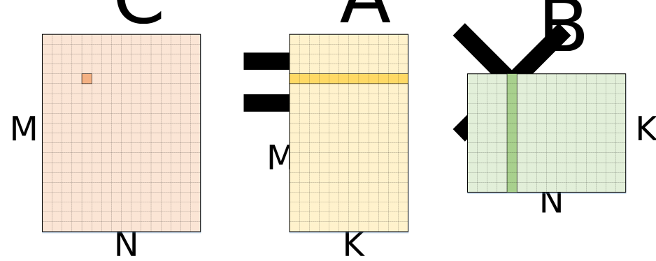
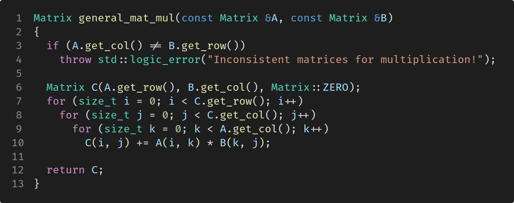
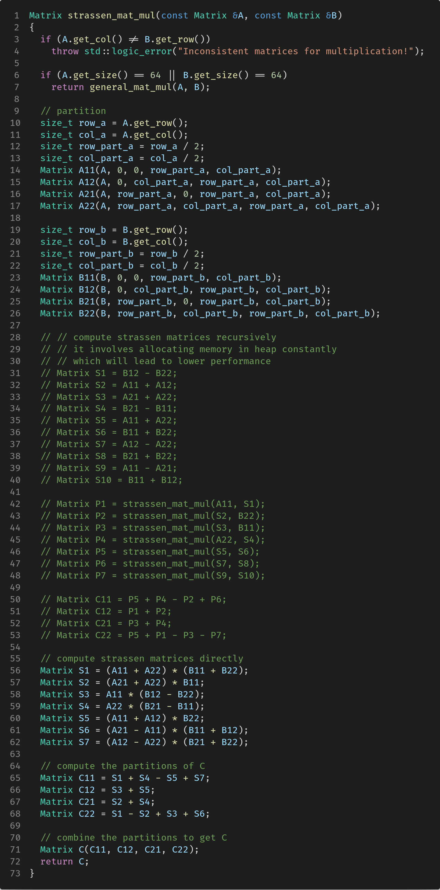
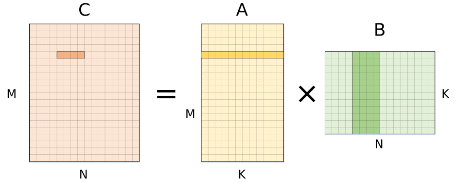
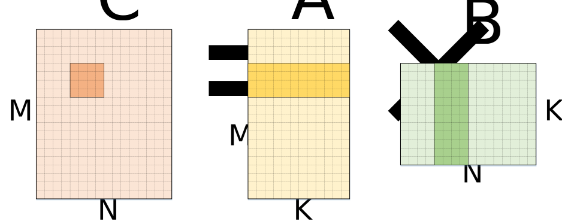
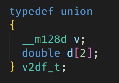
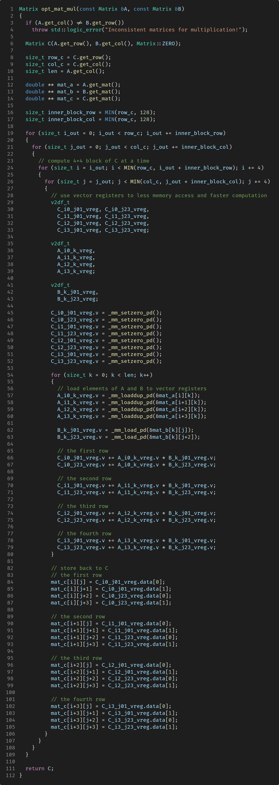
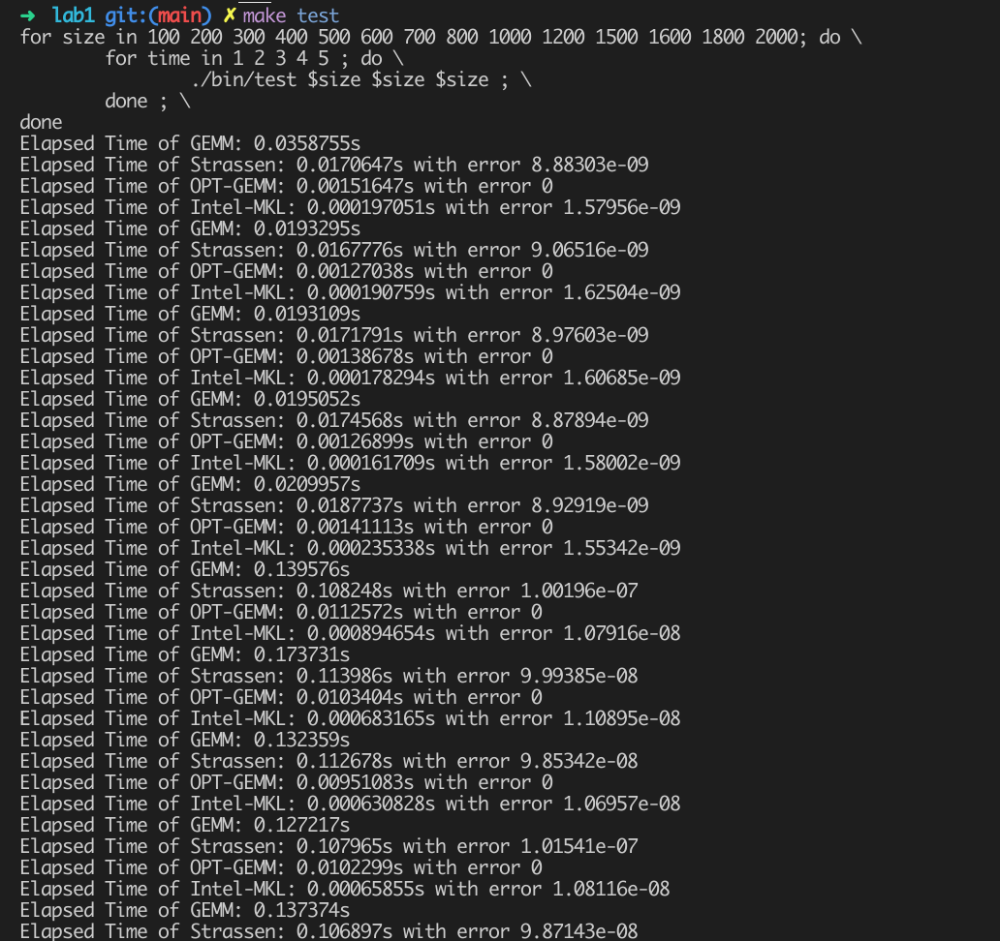
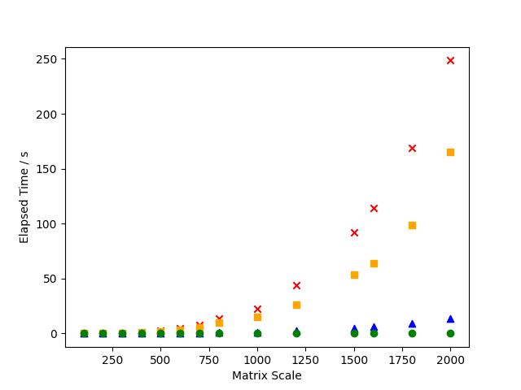
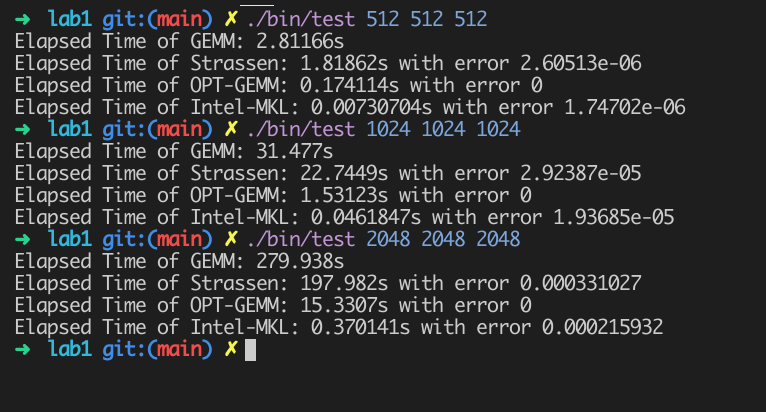

# Lab 1: 矩阵乘法的优化

|                                    |                         |
| :--------------------------------- | :---------------------- |
| **学号：19335109**                 | **课程：高性能计算**    |
| **姓名：李雪堃**                   | **学期：Fall 2021**     |
| **专业：计算机科学与技术（超算）** | **教师：黄聃、卢宇彤**  |
| **邮箱：i@xkun.me**                | **TAs：江嘉治、刘亚辉** |

---

***Table of Contents***

[toc]

---

## (一) 实验任务

实现通用矩阵乘法 GEMM，并对其进行算法和软件两个方面的优化，进一步地，描述大规模矩阵计算的优化。

## (二) 实验环境

- OS: Ubuntu 20.04.2 LTS
- CPU: Intel(R) Core(TM) i5-8250U CPU @ 1.60GHz
- Compiler: gcc 9.3.0
- External Libraries: Intel MKL

## (三) 实验过程和核心代码

### (1) 朴素矩阵乘法

矩阵乘法通常定义为：

$$
A = BC \ (A \in \R^{m \times k}, B \in \R^{k \times n}, C \in \R^{m \times n}) \\
C_{m, n} = \sum^k_{p=1} A_{m, p} B_{p, n} (m, n, k \in \R^n)
$$


相对应的伪代码表示为：

```C
for (int i = 0; i < M; i++)
{
  for (int j = 0; j < N; j++)
  {
    C[i][j] = 0;
    for (int p = 0; p < K; p++)
      C[i][j] += A[i][p] * B[p][j];
  }
}
```

我采用 C++ 实现，首先，我实现了一个 Matrix 类，具体的代码在 `include/Matrix.h`、`include/Matrix.cpp` 下。

我采用动态二维数组的方式存储矩阵，并重载了 `=`、`+`、`-`、`<<` 等运算符用于矩阵的运算和打印操作。

通用矩阵乘法的实现在 `include/Matrix_Mul.h` 和 `src/Matrix_Mul.cpp` 中，函数名为 `general_mat_mul`，输入是两个矩阵对象，输出是它们的乘积。`Matrix::ZERO` 是 Matrix 类中一个 const 型静态成员，用来作为构造函数的参数，表明矩阵初始化为全 0 矩阵。



### (2) Strassen 算法

Strassen 算法将矩阵 $A,\ B,\ C \in R^{n^2 \times n^2}$ 分别拆分为更小的矩阵：
$$
\mathbf{A} =
\begin{bmatrix}
\mathbf{A}_{1,1} & \mathbf{A}_{1,2} \\
\mathbf{A}_{2,1} & \mathbf{A}_{2,2}
\end{bmatrix},
\mathbf{B} =
\begin{bmatrix}
\mathbf{B}_{1,1} & \mathbf{B}_{1,2} \\
\mathbf{B}_{2,1} & \mathbf{B}_{2,2}
\end{bmatrix},
\mathbf{C} =
\begin{bmatrix}
\mathbf{C}_{1,1} & \mathbf{C}_{1,2} \\
\mathbf{C}_{2,1} & \mathbf{C}_{2,2}
\end{bmatrix}
$$
其中 $A_{i,j},\ B_{i,j},\ C_{i,j} \in R^{2^{n-1} \times 2^{n-1}}$。

根据矩阵乘法的基本运算法则，拆分后的朴素算法的计算如下，一共需要 8 次小矩阵乘法和 4 次小矩阵加法计算。显然，分治本身并不能改进矩阵乘的计算效率。
$$
\begin{align}
\mathbf{C}_{1,1} &= \mathbf{A}_{1,1} \mathbf{B}_{1,1} + \mathbf{A}_{1,2} \mathbf{B}_{2,1} \\
\mathbf{C}_{1,2} &= \mathbf{A}_{1,1} \mathbf{B}_{1,2} + \mathbf{A}_{1,2} \mathbf{B}_{2,2} \\
\mathbf{C}_{2,1} &= \mathbf{A}_{2,1} \mathbf{B}_{2,1} + \mathbf{A}_{2,2} \mathbf{B}_{2,1} \\
\mathbf{C}_{2,2} &= \mathbf{A}_{2,1} \mathbf{B}_{2,2} + \mathbf{A}_{2,2} \mathbf{B}_{2,2}
\end{align}
$$
Strassen 引入了 7 个用于辅助计算的中间矩阵：
$$
\begin{align}
\mathbf{M}_{1} &:=\left(\mathbf{A}_{1,1}+\mathbf{A}_{2,2}\right)\left(\mathbf{B}_{1,1}+\mathbf{B}_{2,2}\right) \\
\mathbf{M}_{2} &:=\left(\mathbf{A}_{2,1}+\mathbf{A}_{2,2}\right) \mathbf{B}_{1,1} \\
\mathbf{M}_{3} &:=\mathbf{A}_{1,1}\left(\mathbf{B}_{1,2}-\mathbf{B}_{2,2}\right) \\
\mathbf{M}_{4} &:=\mathbf{A}_{2,2}\left(\mathbf{B}_{2,1}-\mathbf{B}_{1,1}\right) \\
\mathbf{M}_{5} &:=\left(\mathbf{A}_{1,1}+\mathbf{A}_{1,2}\right) \mathbf{B}_{2,2} \\
\mathbf{M}_{6} &:=\left(\mathbf{A}_{2,1}-\mathbf{A}_{1,1}\right)\left(\mathbf{B}_{1,1}+\mathbf{B}_{1,2}\right) \\
\mathbf{M}_{7} &:=\left(\mathbf{A}_{1,2}-\mathbf{A}_{2,2}\right)\left(\mathbf{B}_{2,1}+\mathbf{B}_{2,2}\right)
\end{align}
$$
在得到这些中间矩阵后，将其组合得到矩阵 $C$ 的 4 个块：
$$
\begin{align}
\mathbf{C}_{1,1} &=\mathbf{M}_{1}+\mathbf{M}_{4}-\mathbf{M}_{5}+\mathbf{M}_{7} \\
\mathbf{C}_{1,2} &=\mathbf{M}_{3}+\mathbf{M}_{5} \\
\mathbf{C}_{2,1} &=\mathbf{M}_{2}+\mathbf{M}_{4} \\
\mathbf{C}_{2,2} &=\mathbf{M}_{1}-\mathbf{M}_{2}+\mathbf{M}_{3}+\mathbf{M}_{6}
\end{align}
$$
Strassen 算法的思想是将对矩阵进行分块乘法，并通过构造辅助计算的中间矩阵，减少矩阵乘法的运算次数。该算法突破性地将矩阵乘的复杂度从 $O(n^3)$ 拉了下来，降低到 $O(n^{log_27})$（通过递归地运行 Strassen 算法），后续的算法如 Coppersmith-Winograd 算法都是对该算法某种程度上的改进。



在具体实现 Strassen 算法时，可以看到，起初我采用递归的方式计算中间矩阵（我注释掉的那部分），但是由于我们在函数中需要建立矩阵，所以不断地调用 Matrix 的构造函数，创建二维数组，而这需要不断地向操作系统申请内存，因为底层是系统调用，所以递归运行 Strassen 算法极其耗时，效率比朴素的矩阵乘法还要低。

网上查阅得知，实际上不用递归调用，直接利用中间矩阵计算 $C$ 矩阵的分块，再组合起来即可，时间复杂度已经降低。

### (3) 矩阵乘法的优化

朴素矩阵乘法在性能上非常差，原因主要有以下几点：

- C/C++ 存储二维数组是按行优先的方式存储的，而最内层对矩阵 B 的访存是按列访问的，大部分现代处理器的一个 cache line 占 64B，即存储 16 个单精度浮点数或 8 个双精度浮点数，只要矩阵规模稍大一些，就会造成非常多的 cache miss，对性能产生很大的影响。
- 在第二层循环中，对 `A[i][p]` 的访存是重复进行的，即当 `j` 递增一次进入下一次循环时，最内层循环计算时还是在用 `A[i][p]`，这造成了很多不必要的访存，即使 `A[i][p]` 可能仍然在 cache 中。

这些都是访存方面的优化，更进一步地说，都是由冯诺伊曼瓶颈造成的，即计算机硬件结构和 CPU 设计造成的，本质上减少的是程序中 data fetch 的次数。

#### 1. 循环展开

针对上面提到的两点问题，我们可以初步对矩阵乘法进行下面的访存优化：

```C
for (int i = 0; i < M; i++)
{
  for (int j = 0; j < N; j += 4)
  {
    for (int p = 0; p < K; p++)
    {
      register r = A[i][p];
      C[i][j] = r * B[p][j];
      C[i][j+1] = r * B[p][j+1];
      C[i][j+2] = r * B[p][j+2];
      C[i][j+3] = r * B[p][j+3];
    }
  }
}
```

注意到，在第二层循环中，循环变量 `j` 每次循环递增 4 而不是 1，这是因为我们将朴素的矩阵乘法的最内层循环进行了循环展开 (loop unrolling)，最内层循环在一次循环中会更新 4 个元素而不是 1 个。这相当于每次计算 C 的一行连续的 4 个元素。



这样做的原因是，在计算 `C[i][j]`、`C[i][j+1]`、`C[i][j+2]`、`C[i][j+3]` 时，我们所用到的元素都是 `A[i][p]`，因此可以将循环展开，优化对 `A[i][p]` 的访存，而且在最内层循环开始时，我们还可以将 `A[i][p]` 首先放到 CPU 寄存器中存储，这样可以将对 `A[i][p]` 的访存次数从 4 减少到 1，而访问寄存器的内容是远远快于访存的。

沿着这个方向，我们还可以将最外层的循环进行展开，这样可以每次计算 C 的一个 4x4 的块。



那么，我们的代码将会变成：

```c
for (int i = 0; i < M; i += 4)
{
  for (int j = 0; j < N; j += 4)
  {
    for (int p = 0; p < K; p++)
    {
      // the first row
      C[i][j] += A[i][p] * B[p][j];
      C[i][j+1] += A[i][p] * B[p][j+1];
      C[i][j+2] += A[i][p] * B[p][j+2];
      C[i][j+3] += A[i][p] * B[p][j+3];
      
      // the second row
      C[i+1][j] += A[i+1][p] * B[p][j];
      C[i+1][j+1] += A[i+1][p] * B[p][j+1];
      C[i+1][j+2] += A[i+1][p] * B[p][j+2];
      C[i+1][j+3] += A[i+1][p] * B[p][j+3];
      
      // the third row
      C[i+2][j] += A[i+2][p] * B[p][j];
      C[i+2][j+1] += A[i+2][p] * B[p][j+1];
      C[i+2][j+2] += A[i+2][p] * B[p][j+2];
      C[i+2][j+3] += A[i+2][p] * B[p][j+3];
      
      // the fourth row
      C[i+3][j] += A[i+3][p] * B[p][j];
      C[i+3][j+1] += A[i+3][p] * B[p][j+1];
      C[i+3][j+2] += A[i+3][p] * B[p][j+2];
      C[i+3][j+3] += A[i+3][p] * B[p][j+3];
    }
  }
}
```

同样的，我们很容易观察到最内层循环计算时，会重复访问 C 的这 4x4 小块的每个元素，每次循环都会访问一轮。而且会重复访问 `A[i][p]`、`A[i][p+1]`、`A[i][p+2]`、`A[i][p+3]` 各四次，重复访问 `B[p][j]`、`B[p][j+1]`、`B[p][j+2]`、`B[p][j+3]` 各四次。

于是，我们可以在最内层循环每次循环开始时，将要用到的 A、B 的元素加载到寄存器中，这样避免了大量的不必要的访存。

而且，在计算过程中，不必每次将累加的值直接送给内存中的 C 的元素，而是将累加的值暂存到寄存器中，循环结束后，再传递给 4x4 块的每个元素。

```C
for (int i = 0; i < M; i += 4)
{
  for (int j = 0; j < N; j += 4)
  {
    register 
 			c_i_j, c_i_j1, c_i_j2, c_i_j3,
    	c_i1_j, c_i1_j1, c_i1_j2, c_i1_j3,
      c_i2_j, c_i2_j1, c_i2_j2, c_i2_j3,
      c_i3_j, c_i3_j1, c_i3_j2, c_i3_j3;	// also set them to zero
   	
    register 
      a_i_p, a_i1_p, a_i2_p, a_i3_p;
    
    register
      b_p_j, b_p_j1, b_p_j2, b_p_j3;
    
    for (int p = 0; p < K; p++)
    {
      // the first row
      c_i_j += a_i_p * b_p_j;
      c_i_j1 += a_i_p * b_p_j1;
      c_i_j2 += a_i_p * b_p_j2;
      c_i_j3 += a_i_p * b_p_j3;
      
      // the second row
      c_i1_j += a_i1_p * b_p_j;
      c_i1_j1 += a_i1_p * b_p_j1;
      c_i1_j2 += a_i1_p * b_p_j2;
      c_i1_j3 += a_i1_p * b_p_j3;
      
      // the third row
      c_i2_j += a_i2_p * b_p_j;
      c_i2_j1 += a_i2_p * b_p_j1;
      c_i2_j2 += a_i2_p * b_p_j2;
      c_i2_j3 += a_i2_p * b_p_j3;
      
      // the fourth row
      c_i3_j += a_i3_p * b_p_j;
      c_i3_j1 += a_i3_p * b_p_j1;
      c_i3_j2 += a_i3_p * b_p_j2;
      c_i3_j3 += a_i3_p * b_p_j3;
    }
    
    // the first row
    C[i][j] 	= c_i_j;     C[i][j+1] = c_i_j1;
    C[i][j+1] = c_i_j2;    C[i][j+2] = c_i_j3;
    
    // the second row
    C[i+1][j] 	= c_i1_j;  C[i+1][j+1] = c_i1_j1;
    C[i+1][j+2] = c_i1_j2; C[i+1][j+3] = c_i1_j3;
    
    // the third row
    C[i+2][j] 	= c_i2_j;  C[i+2][j+1] = c_i2_j1;
    C[i+2][j+2] = c_i2_j2; C[i+2][j+3] = c_i2_j3;
    
    // the fourth row
    C[i+3][j] 	= c_i3_j;  C[i+3][j+1] = c_i3_j1;
    C[i+3][j+1] = c_i3_j2; C[i+3][j+2] = c_i3_j3;
  }
}
```

#### 2. 使用向量指令

考虑到矩阵乘法的特点，我们实际上使用循环进行了大量的向量相乘操作，而这些操作都可以用向量指令来完成。由于大多数计算机的 CPU 是 Intel CPU，所以可以使用 Intel 提供的 SSE/AVX 等向量指令实现 SIMD 的矩阵乘法。

我编程时使用的是 SSE3 指令集，为了方便代码上对寄存器进行存取，我在 `mat_mul.h` 中定义了一个 `v2df_t` 共用体。`__m128d` 类型可以存储两个双精度浮点数即 `double` 类型的变量，可以用两个 `double` 对 `__m128d` 内存进行对齐，这样就可以直接从向量寄存器中取出这两个元素了。



代码上，我沿用上面优化后的代码，对 C 进行 4x4 分块计算，在访存优化后的情况下，使用向量寄存器一次存两个元素。

实际上就使得前面用到的寄存器数量减少了一半，装载寄存器时用到了 SSE3 的指令，在做乘法运算是可以直接用运算符 `*`。

```C
for (int i = 0; i < m; i += 4)
{
  for (int j = 0; j < n; j += 4)
  {
    // use vector registers to less memory access and faster computation
    v2df_t 
      C_i0_j01_vreg, C_i0_j23_vreg,
      C_i1_j01_vreg, C_i1_j23_vreg,
      C_i2_j01_vreg, C_i2_j23_vreg,
      C_i3_j01_vreg, C_i3_j23_vreg;

    v2df_t
      A_i0_k_vreg,
      A_i1_k_vreg,
      A_i2_k_vreg,
      A_i3_k_vreg;

    v2df_t
      B_k_j01_vreg,
      B_k_j23_vreg;

    C_i0_j01_vreg.v = _mm_setzero_pd();
    C_i0_j23_vreg.v = _mm_setzero_pd();
    C_i1_j01_vreg.v = _mm_setzero_pd();
    C_i1_j23_vreg.v = _mm_setzero_pd();
    C_i2_j01_vreg.v = _mm_setzero_pd();
    C_i2_j23_vreg.v = _mm_setzero_pd();
    C_i3_j01_vreg.v = _mm_setzero_pd();
    C_i3_j23_vreg.v = _mm_setzero_pd();

    for (int k = 0; k < len; k++)
    {
      // load elements of A and B to vector registers
      A_i0_k_vreg.v = _mm_loaddup_pd(&mat_a[i][k]);
      A_i1_k_vreg.v = _mm_loaddup_pd(&mat_a[i+1][k]);
      A_i2_k_vreg.v = _mm_loaddup_pd(&mat_a[i+2][k]);
      A_i3_k_vreg.v = _mm_loaddup_pd(&mat_a[i+3][k]);

      B_k_j01_vreg.v = _mm_load_pd(&mat_b[k][j]);
      B_k_j23_vreg.v = _mm_load_pd(&mat_b[k][j+2]);

      // the first row
      C_i0_j01_vreg.v += A_i0_k_vreg.v * B_k_j01_vreg.v;
      C_i0_j23_vreg.v += A_i0_k_vreg.v * B_k_j23_vreg.v;

      // the second row
      C_i1_j01_vreg.v += A_i1_k_vreg.v * B_k_j01_vreg.v;
      C_i1_j23_vreg.v += A_i1_k_vreg.v * B_k_j23_vreg.v;

      // the third row
      C_i2_j01_vreg.v += A_i2_k_vreg.v * B_k_j01_vreg.v;
      C_i2_j23_vreg.v += A_i2_k_vreg.v * B_k_j23_vreg.v;

      // the fourth row
      C_i3_j01_vreg.v += A_i3_k_vreg.v * B_k_j01_vreg.v;
      C_i3_j23_vreg.v += A_i3_k_vreg.v * B_k_j23_vreg.v;
    }

    // store back to C
    // the first row
    mat_c[i][j] = C_i0_j01_vreg.data[0];
    mat_c[i][j+1] = C_i0_j01_vreg.data[1];
    mat_c[i][j+2] = C_i0_j23_vreg.data[0];
    mat_c[i][j+3] = C_i0_j23_vreg.data[1];

    // the second row
    mat_c[i+1][j] = C_i1_j01_vreg.data[0];
    mat_c[i+1][j+1] = C_i1_j01_vreg.data[1];
    mat_c[i+1][j+2] = C_i1_j23_vreg.data[0];
    mat_c[i+1][j+3] = C_i1_j23_vreg.data[1];

    // the third row
    mat_c[i+2][j] = C_i2_j01_vreg.data[0];
    mat_c[i+2][j+1] = C_i2_j01_vreg.data[1];
    mat_c[i+2][j+2] = C_i2_j23_vreg.data[0];
    mat_c[i+2][j+3] = C_i2_j23_vreg.data[1];

    // the fourth row
    mat_c[i+3][j] = C_i3_j01_vreg.data[0];
    mat_c[i+3][j+1] = C_i3_j01_vreg.data[1];
    mat_c[i+3][j+2] = C_i3_j23_vreg.data[0];
    mat_c[i+3][j+3] = C_i3_j23_vreg.data[1];
	}
}
```

#### 3. 分块计算

上面的代码看似已经优化到极限了，但仅仅是对于代码中直接的访存部分。

实际上，当矩阵规模不断增大到 L2 cache 容纳不下的时候，程序的性能会下降得相当大，为了在矩阵规模更大时维持一个更稳定、相对更高的性能，我们可以对矩阵 $C$ 进行分块，我们在 4x4 的分块外层再对 $C$ 进行一次分块，使大的分块小于或刚好等于 L2 cache 的容量，这样在矩阵规模较大时，能够减少很多的 cache miss，从而获得相对更高、更稳定的性能表现。

我选择的外层分块大小为 128x128（如果矩阵 $C$ 的规模小于此，则只进行 4x4 的分块）。 



### (4) 大规模矩阵计算的优化

大规模矩阵乘法在存储上，可以采用稀疏矩阵的压缩存储方式，比如 COO 格式。

将矩阵的非零元素以坐标的方式存储，即将非零元素的行、列、值三个元素记录下来，其余的则全是 0，不用关心。

还有其他的格式如 CSR、MSR 格式等，效率比 COO 要高，对于大规模稀疏矩阵，这样做可以极大地减少内存的消耗，不触发内存溢出的异常。

对于大规模稀疏矩阵乘法的运算，我的思想是，按照压缩的格式进行乘法，其余的不用算，因为乘积一定是 0。比如对于 (i, j) 元素，只要按压缩的格式找到 A 的 (i, k) 元素且 B 的 (k, j) 元素（如果有的话），做乘积并记录下来，最后将这些乘积加和即可，可以这么做的原因是，0 一定不会被压缩存储了。

## (四) 实验结果

在项目目录下，执行 `make test`，测试会依次在 ==100 ～ 2000== 范围随机生成矩阵，==执行 5 次==朴素矩阵乘、Strassen算法、优化的矩阵乘、Intel MKL，然后将各自的==平均运行时间==输出到 `asset` 目录下的对应文件中。（这总共需要大约 1 个小时的时间跑完，如果想要进行一些小型的测试，请使用 `make smalltest` 命令，默认小型测试的矩阵规模为 512）

执行起来，会像下面这样：



注意到，为了验证计算的正确性，我在 Matrix 类中实现了一个 `error` 方法，会计算两个矩阵各个元素差的绝对值之和（就是每个元素差的绝对值，再全部相加）来作为结果的误差。我们认为朴素矩阵乘法给出的矩阵是准确的，其他的三种方法计算的结果都是与 GEMM 的结果相比较的误差。可以看到，Strassen 算法在数值上不稳定，Intel MKL 数值上也有些不稳定，但由于误差太小，是完全可以忽略的。

然后 `cd` 到 `script` 目录下，使用 `python3 plot.py` 执行 python 脚本，`plot.py` 会统计 `asset` 目录下生成的运行时间文件中的数据，计算各个规模下 4 个矩阵乘各自的平均运行时间，然后作出散点图。

最后，我们可以得到下面的散点图：



- ==横坐标是矩阵规模，纵坐标是 5 次的平均运行时间==
- ==红色代表朴素矩阵乘，橙色代表 Strassen 算法，蓝色代表我们优化的矩阵乘，绿色代表 Intel MKL==

可以看到，朴素矩阵乘的运行时间随矩阵规模增长较快，矩阵规模为 2000 时需要 250 秒左右的时间，而 Strassen 算法虽然与 GEMM 相比有所提升，但时间消耗仍然非常高，在 175 秒左右。

我们优化后的矩阵乘在 512 规模时仅需 0.174 秒，在 1024 规模时需要 1.53 秒，比 GEMM 的效率高很多倍，虽然与 Intel MKL 的快得惊人的速度相比仍然有一点距离。在 2000 规模时，优化的矩阵乘需要 13 秒左右，而 Intel MKL 仅仅需要 0.33 秒的时间，说明我们的优化在更大规模的矩阵上的性能并不能维持得很好。



## (五) 实验感想

通过这次实验，我学习到了矩阵乘法的优化方法，尤其是软件方面的优化。

循环展开是编译器优化代码时常用到的技术，可以减少一部分的 cache miss；通过向量指令的应用，我真正第一次感受到 SIMD 的作用，第一次真正写了 SIMD 的程序；另外，分块计算也是非常难想到的优化方向，这取决于 CPU 中 L2 cache 的大小，要将矩阵进行合适的分块使之符合 L2 cache，从而减少cache miss，这是我在网上查阅后才知道的。另外，我还看到网上说可以在计算内层 4x4 块前，将需要计算的矩阵 A 的 4 行元素装进一个连续的数组中，因为 A 的内存是不连续的，这样读取的时候会减少 cache miss，但我实现了之后发现性能并未提高，反而有点下降，有点不明所以，所以没有放到优化中。

我感到自己在计算机组成和体系结构方面的知识还有缺失，掌握的不扎实，这次实验第一次让我真切感受到体系结构知识的威力和作用，完全没想到自己优化的矩阵乘到最后可以比朴素矩阵乘快这么多倍，写完后觉得很充实、很有成就感。

总之，这次实验有一定挑战性，同时也非常有趣，点燃了我对高性能计算、并行计算、体系结构的兴趣，我将来想从事这方面的研究。

## 附录：参考资料

- https://jackwish.net/2019/gemm-optimization.html
- https://github.com/flame/how-to-optimize-gemm/wiki
- https://software.intel.com/sites/landingpage/IntrinsicsGuide/
- https://en.wikipedia.org/wiki/Strassen_algorithm
- https://stackoverflow.com/questions/17259877/1d-or-2d-array-whats-faster
- https://stackoverflow.com/questions/14707803/line-size-of-l1-and-l2-caches
- https://sites.cs.ucsb.edu/~tyang/class/240a17/slides/intel-mkl-gemm.pdf
- https://software.intel.com/content/www/us/en/develop/documentation/mkl-tutorial-c/top/multiplying-matrices-using-dgemm.html
- https://software.intel.com/content/www/us/en/develop/tools/oneapi/components/onemkl/link-line-advisor.html
- https://software.intel.com/content/www/us/en/develop/documentation/onemkl-linux-developer-guide/top.html