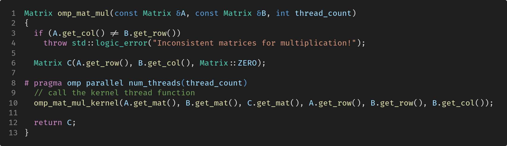
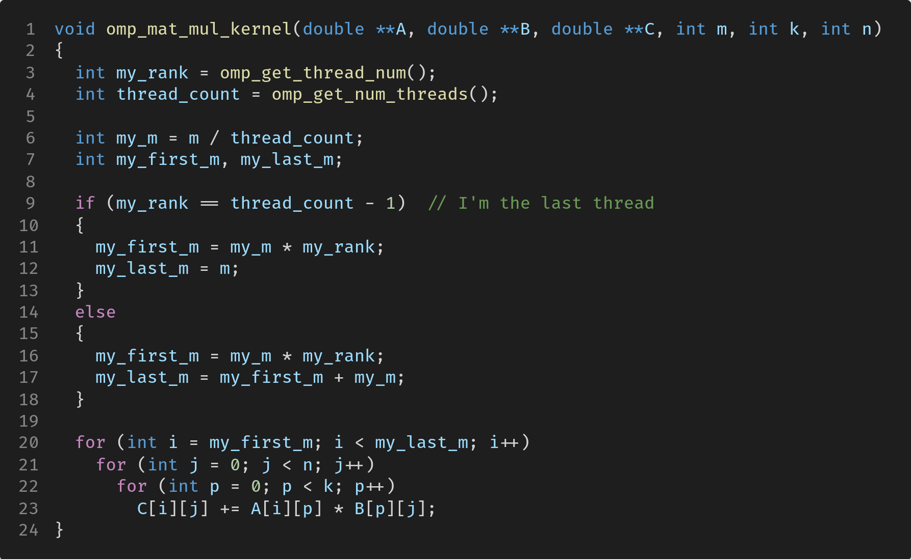
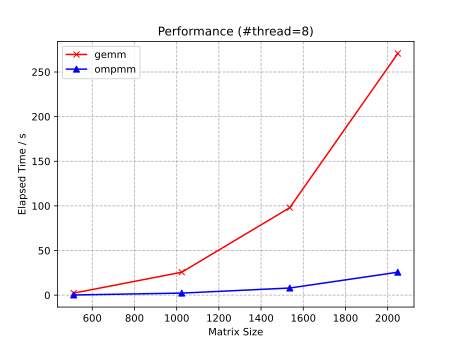
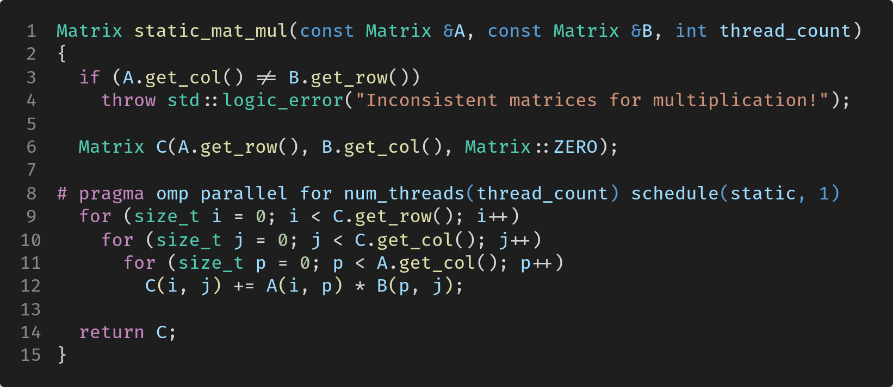
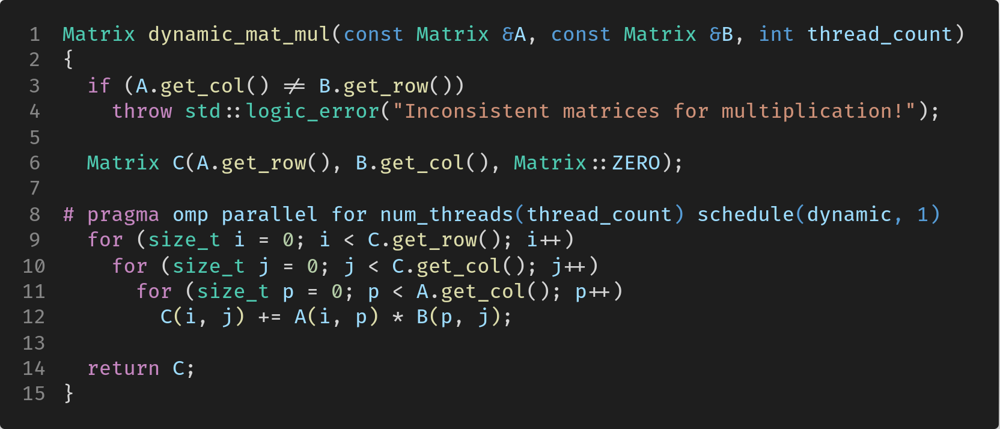
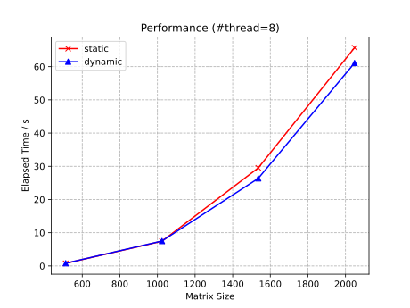
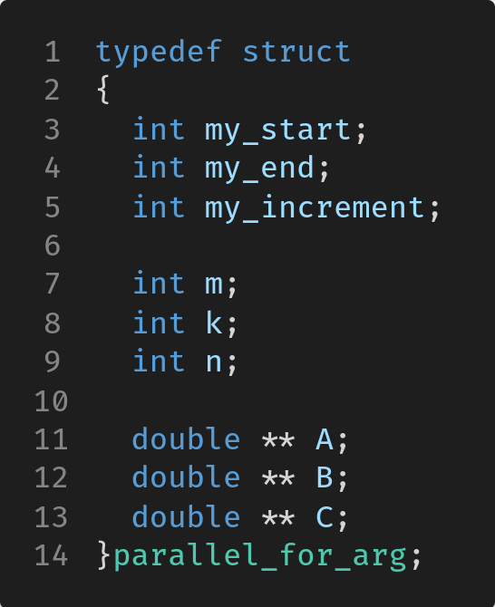
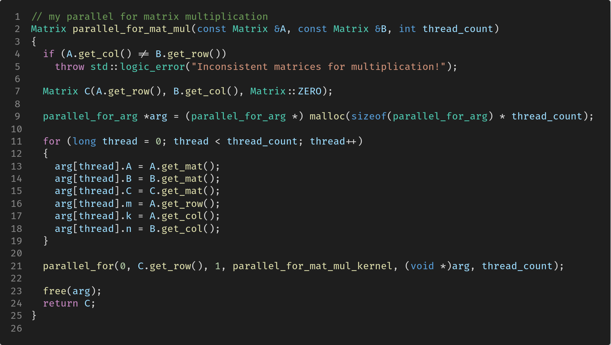
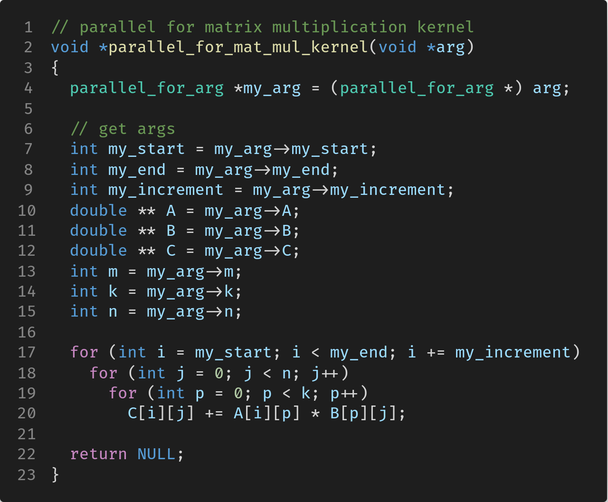
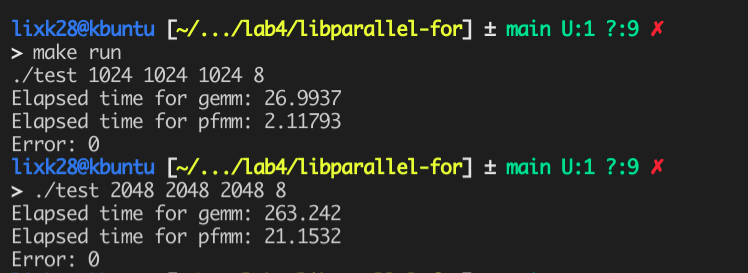

# Lab 4: OpenMP

|                                    |                         |
| :--------------------------------- | :---------------------- |
| **学号：19335109**                 | **课程：高性能计算**    |
| **姓名：李雪堃**                   | **学期：Fall 2021**     |
| **专业：计算机科学与技术（超算）** | **教师：黄聃、卢宇彤**  |
| **邮箱：i@xkun.me**                | **TAs：江嘉治、刘亚辉** |

---

***Table of Contents***

[toc]

---

## (一) 实验任务

- 通过 OpenMP 实现通用矩阵乘法（Lab1）的并行版本，OpenMP 并行线程从 1 增加至 8，矩阵规模从 512 增加至 2048。
- 分别采用 OpenMP 的默认任务调度机制、静态调度 schedule(static, 1) 和动态调度 schedule(dynamic,1)，调度 #pragma omp for 的并行任务，并比较其性能。
- 构造基于 Pthreads 的并行 for 循环分解、分配和执行机制。
  - 基于 pthreads 的多线程库提供的基本函数，如线程创建、线程 join、线程同步等。构建 parallel_for 函数对循环分解、分配和执行机制。
  - 在 Linux 系统中将 parallel_for 函数编译为.so 文件，由其他程序调用。
  - 将通用矩阵乘法的 for 循环，改造成基于 parallel_for 函数并行化的矩阵乘法，注意只改造可被并行执行的 for 循环。

## (二) 实验环境

- Ubuntu 20.04.3 LTS x86_64
- gcc 9.3.0
- GNU Make 4.2.1

## (三) 实验过程和核心代码

### (1) 通过 OpenMP 实现通用矩阵乘法

代码在 `omp-mat-mul` 下。

我采用 C++ 实现矩阵类，这样用户使用会比较方便。OpenMP 矩阵乘法的 API 在 `omp-mat-mul/src` 下，`omp_mat_mul` 是暴露给用户的接口，它接收 3 个参数：矩阵 A、矩阵 B、线程数 thread_count，返回矩阵 C。在 8~10 行，使用 OpenMP 开启 thread_count 个线程执行下面的线程函数 `omp_mat_mul_kernel`，该函数传入的是矩阵的指针以及行列数。

`omp_mat_mul_kernel` 函数首先会读取线程号和线程数，然后计算自己的 `my_first_m` 和 `my_last_m`，也就是自己负责的 C 的行。最后直接按朴素矩阵乘法的计算方法计算即可，这里不会产生数据竞争，对 A 和 B 的操作都是读取，而多个线程不会更新 C 的同一个元素，计算的数据是分开的。

先编译 `make`，再执行 `make test && make plot`，可以在 `omp-mat-mul/asset` 下获得下图。下图是线程数为 8 时，gemm 和 ompmm 的运行时间随矩阵规模的变化。可以看到在矩阵规模是 2048 时，ompmm 的运行时间大约是 gemm 的 1 / 8，效果比较好。

### (2) 基于 OpenMP 的通用矩阵乘法优化

代码在 `omp-schedule` 下。

两种不同调度策略的 OpenMP 矩阵乘法函数在 `omp-schedule/include/matrix_mul.h` 和 `omp-schedule/src/matrix_mul.cpp` 下。

使用 `parallel for` 语句，分别选择调度方式为 `schedule(static, 1)` 和 `schedule(dynamic, 1)`，这样只会对最外层的循环进行拆分和调度。与我们上面实现的 OpenMP 多线程是类似的，每个线程计算 C 的一部分行。

首先 `make` 编译，然后 `make test && make plot` 执行测试和作图。运行时间文件会保存在 `omp-schedule/asset` 下（线程数 1 ～ 8，矩阵规模从 512 ～ 2048）。下面是开启 8 个线程的运行时间对比。 

可以看到，dynamic 的调度方式的表现并不比 static 优秀，稍微要快一点但区别比较小。可能在线程数增大、矩阵规模增大时，表现得更为明显。

### (3) 构造基于 Pthreads 的并行 for 循环分解、分配和执行机制

代码在 `libparallel-for` 下。

首先我们需要厘清目标和函数调用的过程。`parallel_for` 函数的作用是模仿 OpenMP 的 `omp parallel for` 语句，它将开启一定个数的线程，并执行给定的 functor 指针所指向的函数。而 functor 指向的函数是由用户实现的，用户会调用 `parallel_for` 函数，指定 functor。

定义一个 `parallel_for_arg` 结构体，作为 `parallel_for` 函数的参数。它必须包含 `my_start`、`my_end` 和 `my_increment` 这三个参数，用于指定每个线程负责的 for 循环的起始索引、终止索引和循环增量。

这里，它还包括了矩阵的行数、列数，以及矩阵的指针。

这样的实现其实不太好，更好的方法是用一个 `void *` 的指针 `user_arg`，这样 `user_arg` 可以指向用户自己定义的结构体，以提供给 for 循环除了前面三个固定参数之外需要的其他参数。

`parallel_for` 函数的实现如下。代码在 `libparallel-for/src/parallel_for.cpp ` 中。

4 ～ 5 行，首先分配线程块，获得线程参数列表的指针。7 ～ 22 行，初始化线程参数，这里处理了循环的索引范围不能被线程数除尽的情况，如果是最后一个线程，它的 `my_end` 就是 `end`，否则按照线程号 `my_rank` 计算 `my_end`。

24 ～ 30 行，线程的创建和销毁，线程会执行 functor 指向的函数，传递给 functor 的参数是 `args[thread]`。

调用 `parallel_for` 实现的矩阵乘法函数 `parallel_for_mat_mul` 如下。该函数会初始化线程的参数（用户指定的），然后调用 `parallel_for` 函数。functor 指定为 `parallel_for_mat_mul_kernel`。

`parallel_for_mat_mul_kernel` 的实现如下，该函数会使用传递来的参数，根据 `my_start`、`my_end` 和 `my_increment` 进行循环。

执行 `make lib`，会在 `libparallel-for/lib` 下生成 `libparallel-for.so` 的共享库。然后执行 `make test`，会将 `test.cpp` 编译并与该共享库链接，生成可执行文件 test。

接下来执行 `make run`，默认开启 8 个线程，矩阵规模为 1024x1024x1024。下面是 8 个线程下， 1024 和 2048 两种规模的 gemm 和 pfmm 的运行时间对比。可以看到性能表现很好，除了并行的原因，还因为 kernel 函数使用指针来运算更为快速。

## (四) 实验结果

实验的结果在上面每步都已经展示。

## (五) 实验感想

OpenMP 的实验感觉也比较简单，这次实验中比较有趣的部分是使用 pthread 实现 `parallel_for` 函数，实际上要做的是创建销毁线程，以及分配线程函数。另外，复习了前面实验制作共享库的方法。

## 附录：参考资料

- https://stackoverflow.com/questions/7352099/stdstring-to-char/7352131
- https://stackoverflow.com/questions/8120312/assigning-stringc-str-to-a-const-char-when-the-string-goes-out-of-scope
- https://stackoverflow.com/questions/230062/whats-the-best-way-to-check-if-a-file-exists-in-c