# Lab 6: CUDA 矩阵乘法和卷积

|                                |                     |
| :----------------------------- | :------------------ |
| 学号：19335109                 | 课程：高性能计算    |
| 姓名：李雪堃                   | 学期：Fall 2021     |
| 专业：计算机科学与技术（超算） | 教师：黄聃、卢宇彤  |
| 邮箱：i@xkun.me                | TAs：江嘉治、刘亚辉 |

---

***Table of Contents***

[toc]

---

## (一) 实验任务

- 任务一：通过 CUDA 实现通用矩阵乘法（Lab1）的并行版本，CUDA Thread
  Block size 从 32 增加至 512，矩阵规模从 512 增加至 8192。
- 任务二：通过 NVDIA 的矩阵计算函数库 CUBLAS 计算矩阵相乘，矩阵规模
  从 512 增加至 8192，并与任务 1 和任务 2 的矩阵乘法进行性能比较和分析，如果性能不如 CUBLAS，思考并文字描述可能的改进方法。
- 任务三：用直接卷积的方式对 Input 进行卷积，这里只需要实现 2D,
  height * width，通道 channel (depth) 设置为 3，Kernel (Filter) 大小设置
  为 3 * 3，步幅 (stride) 分别设置为 1、2、3，可能需要通过填充 (padding)
  配合步幅 (stride) 完成 CNN 操作。注：实验的卷积操作不需要考虑
  bias，bias 设置为 0。
- 任务四：使用 im2col 方法结合任务 1 实现的 GEMM（通用矩阵乘法）实现卷积操作。输入从 256 增加至 4096 或者输入从 32 增加至 512。
- 任务五：使用 NVIDIA cuDNN 提供的卷积方法进行卷积操作，记录其相应 Input 的卷积时间，与自己实现的卷积操作进行比较。如果性能不如 cuDNN，
  用文字描述可能的改进方法 。

## (二) 实验环境

- 学院集群，GPU 配置如下：

  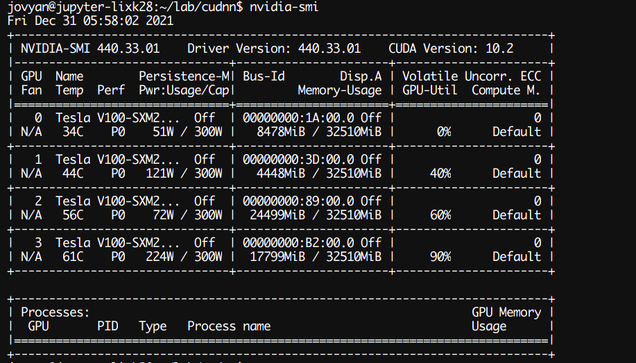

## (三) 实验过程和核心代码

### (1) CUDA 通用矩阵乘法

代码在 `cuda-mm` 下。

CUDA 矩阵乘法：

- 函数将 `cudaMalloc` 和 `cudaMemcpy`、设置 grid 和 block、调用核函数的过程封装起来，接收矩阵 A (m x k)、B (k x n)、C (m x n)，其中 A 和 B 参与计算，C 是计算结果。

- 根据老师的意思，grid 和 block 都采用一维划分，固定线程总数不变、改变 block size，如果用二维划分就很难写。
- 线程总数为矩阵 C 的行数 m，每个线程负责计算 C 的一行。

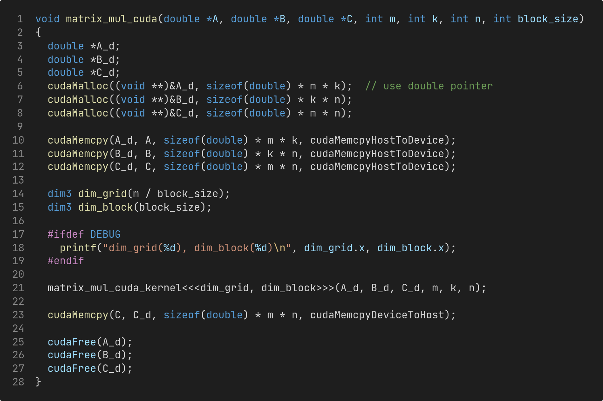

CUDA 矩阵乘法核函数：

- 每个线程通过 `threadIdx` 和 `blockIdx` 计算自己负责的行索引，计算 C 的一行，这里还交换了一下循环的次序，减少一部分 cache miss。

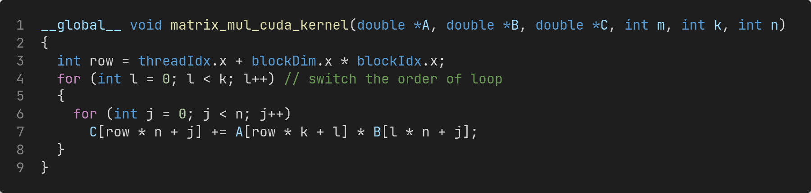

main 函数：

- main 函数的主要代码如下，m、k、n 是从命令行解析的参数，代表矩阵的维数。
- 设置 `srand` 的种子为固定值 20211225，这样每次生成的矩阵是固定的。
- 使用 `get_wall_time()` 函数获得程序运行的墙上时间。

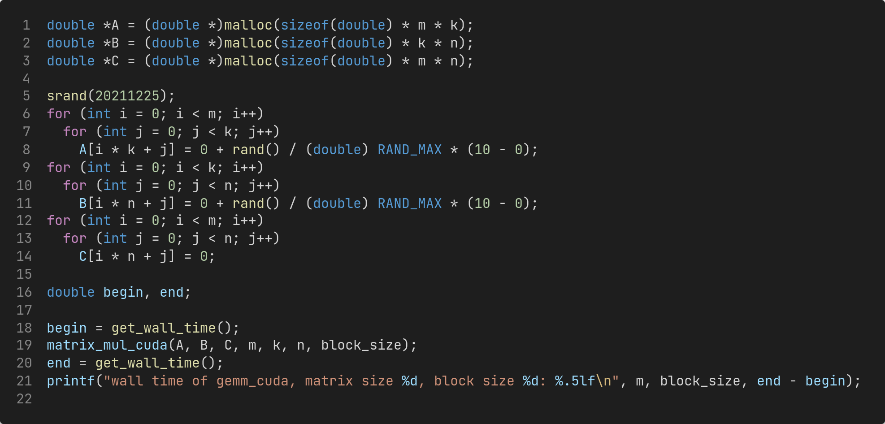

`get_wall_time()` 函数:

- `get_wall_time()` 函数使用 `gettimeofday` 函数获得墙上时间。

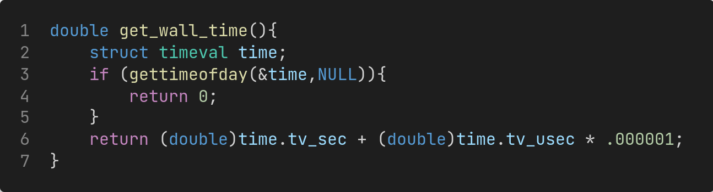

### (2) CUBLAS 矩阵乘法

代码在 `cublas-mm` 下。

CUBLAS 矩阵乘法：

- 同样传递三个矩阵和它们的维数作为函数参数。

- CUBLAS 矩阵乘 API（数据类型为 double）

  ```C
  cublasStatus_t cublasDgemm(cublasHandle_t handle,
                             cublasOperation_t transa, cublasOperation_t transb,
                             int m, int n, int k,
                             const double          *alpha,
                             const double          *A, int lda,
                             const double          *B, int ldb,
                             const double          *beta,
                             double          *C, int ldc)
  ```

- CUBLAS 矩阵乘法的计算公式
  $$
  C = \alpha op(A) op(B) + \beta op(C)
  $$
  其中，$op$ 是指根据输入的参数来决定是否对矩阵进行转置或共轭转置。
  $$
  op(M) = 
  \begin{cases}
  M & \text{if transm == CUBLAS\_OP\_N} \\
  M^T & \text{if transm == CUBLAS\_OP\_T} \\
  M^H & \text{if transm == CUBLAS\_OP\_C} \\
  \end{cases}
  $$
  我们需要计算的是 $C = AB$，因此 `alpha` 设置为 1.0、`beta` 设置为 0.0。注意到，`cublasDgemm` 默认矩阵是列优先存储的，而我们的矩阵是行优先存储，所以不对 A 和 B 进行转置的话，会将我们行优先存储的矩阵按照列优先的方式读取。

  计算行优先的 $C$ 就是计算 $C^T$，而 $A^T$ 和 $B^T$ 就是行优先存储的，我们已经准备好了，不需要进行转置：
  $$
  C^T = (AB)^T = B^TA^T
  $$
  所以调用 `cublasDgemm` 如下：

  ```C
  cublasDgemm(handle, CUBLAS_OP_N, CUBLAS_OP_N, n, m, k, &alpha, B_d, n, A_d, k, &beta, C_d, n);
  ```

  不对行优先存储的 `A_d` 和 `B_d` 进行转置，设置为 `CUBLAS_OP_N`。

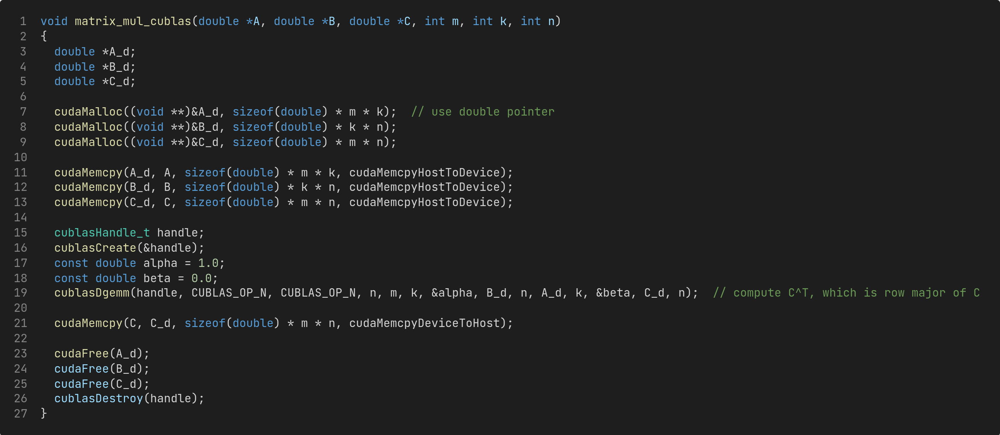

前一个任务中，实现的 CUDA 矩阵乘法很低效，下面采用二维划分的核函数，性能大大提升。每个线程负责计算 C 中的一个值。

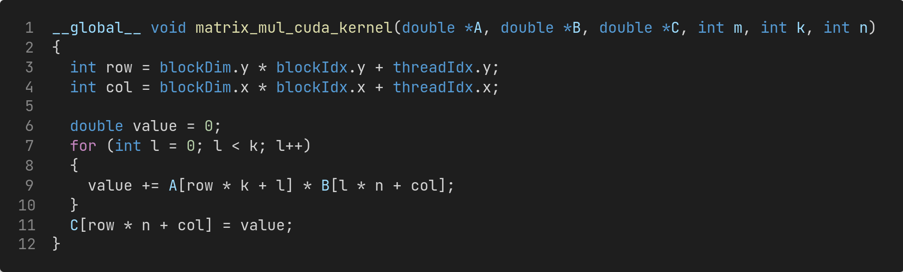

grid 和 block 的 dimension 设置如下：

- 如果 `n` 和 `m` 能被 `block_size` 整除，那么就可以完美地分配线程块，不用浪费。
- 否则向上取整，让 m x n 矩阵可以放进 grid 内，这时会有部分线程浪费掉，不做任何事情。

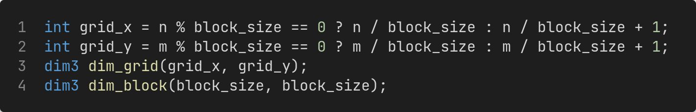

### (3) CUDA 二维卷积

CUDA 二维卷积函数：

- 采取 valid padding 策略，不做 padding，丢弃最右边的列和最下边的行。
- `block_size` 会根据 `ouput_size` 做调整，如果 `output_size` 过小，就设置 `block_size` 为 `output_size`。
- grid 的维度取决于 `output_size` 能否被 `block_size` 整除，不能被整除则向上取整，保证计算不会遗漏。

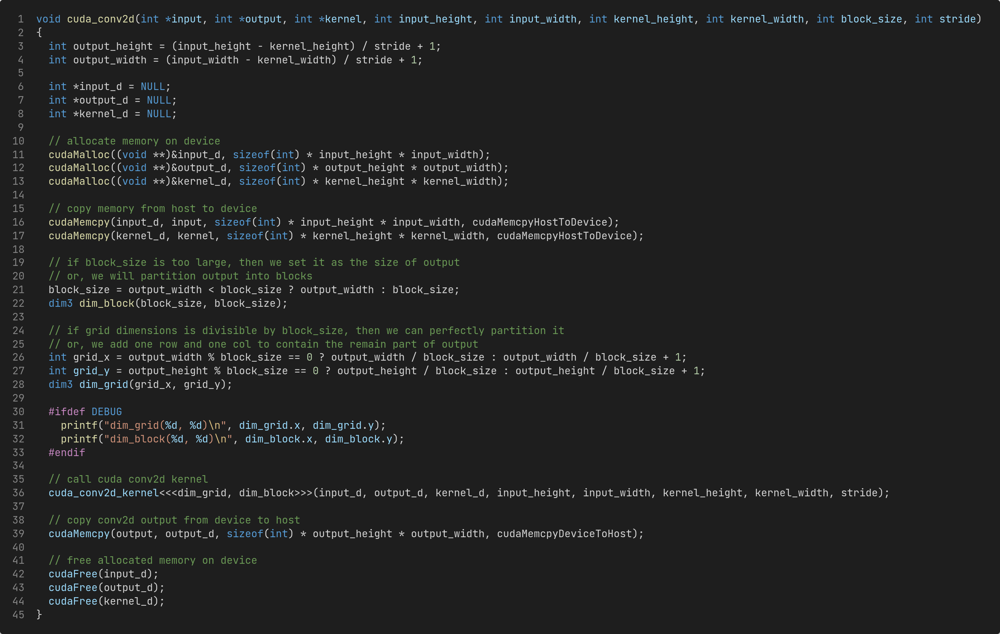

CUDA 二维卷积核函数：

- 每个线程负责计算输出结果的一个值，即进行一次卷积运算。
- `input` 的索引可以通过步长 `stride` 和该线程负责计算的 `output` 的行列索引得到。


CUDA 二维卷积 main 函数主要代码：

- 从命令行获取输入的高度和宽度、步长和线程块大小，卷积核设置为 3x3。
- 固定种子的值，每次生成相同数据的矩阵。

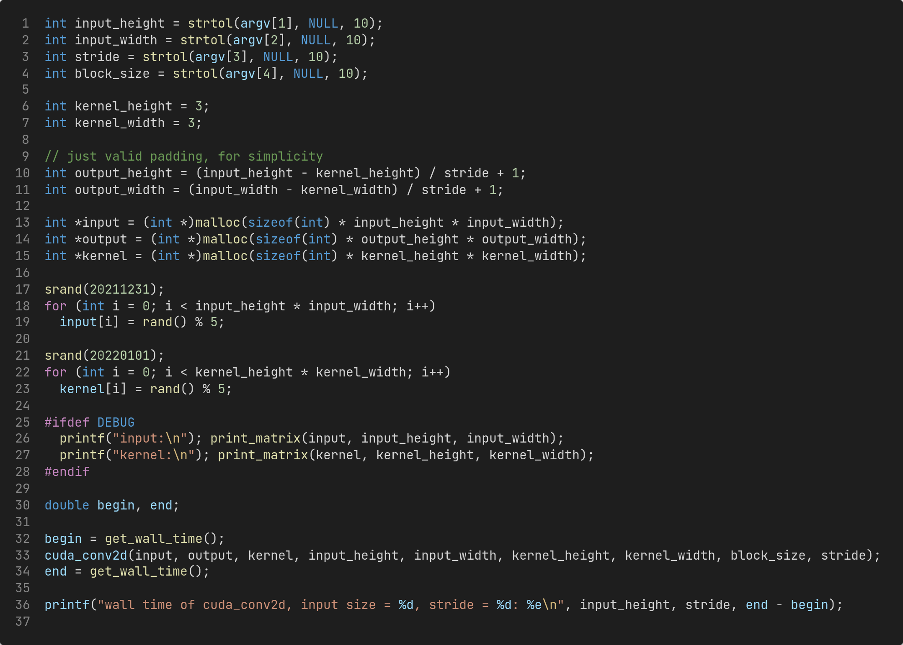

### (4) im2col 二维卷积

im2col 的原理是通过将输入图像按列或按行重排，从而将卷积操作转化为矩阵相乘，矩阵乘无论是在 CPU 还是 GPU 上都有专门优化加速到极致的库可以直接调用，从而加速卷积运算；另外，im2col 操作对于 `batch_size` 较多时，可以充分利用 GPU 内存，将数据组织为连续的内存，减少 cache miss，CUDA 可以直接一次计算整个 batch。

使用 im2col 的 CUDA 二维卷积函数：

- 仍然采用 valid padding，首先将输入的图像经过 `im2col` 函数处理得到 `im_col`，再调用之前的 CUDA 矩阵乘函数计算卷积结果。

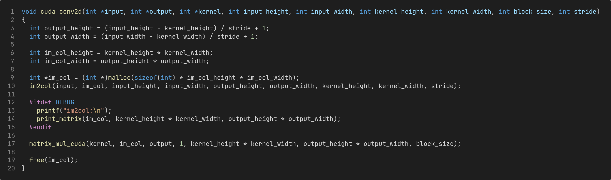

im2col 函数：

- 以步长 `stride` 遍历输入的图像 `input`，将卷积核覆盖的部分按列重排。
- `im_col` 的行数为 `kernel_height * kernel_width`，即卷积核的大小；`im_col` 的列数是 `output_height * output_width`，即输出结果的大小。

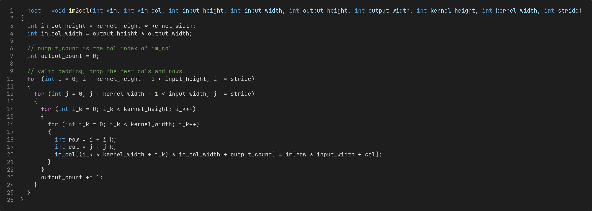

### (5) cuDNN 二维卷积

cuDNN 二维卷积：

- 记录两个时间，一个包括 cuDNN 句柄、描述符、工作空间、算法所有的准备时间和销毁时间；另一个只记录 cuDNN 执行卷积操作的时间。

这里的代码过于冗长、大部分是重复性的工作，不再赘述。

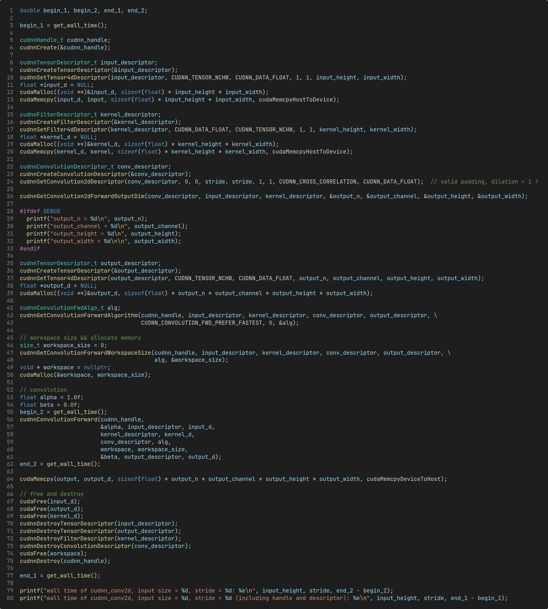

## (四) 实验结果

### (1) CUDA 矩阵乘法

首先保证计算结果的正确性。取消 `#define DEBUG` 的注释，编译运行。设置矩阵规模为 777，block size 为 16，可以看到计算结果与 CPU 矩阵乘法结果的误差为 0。

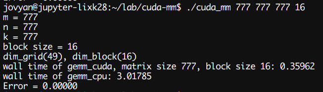

下面是测试的运行时间，矩阵规模从 512 到 8192，对于每种规模的矩阵，block size 32 到 512。

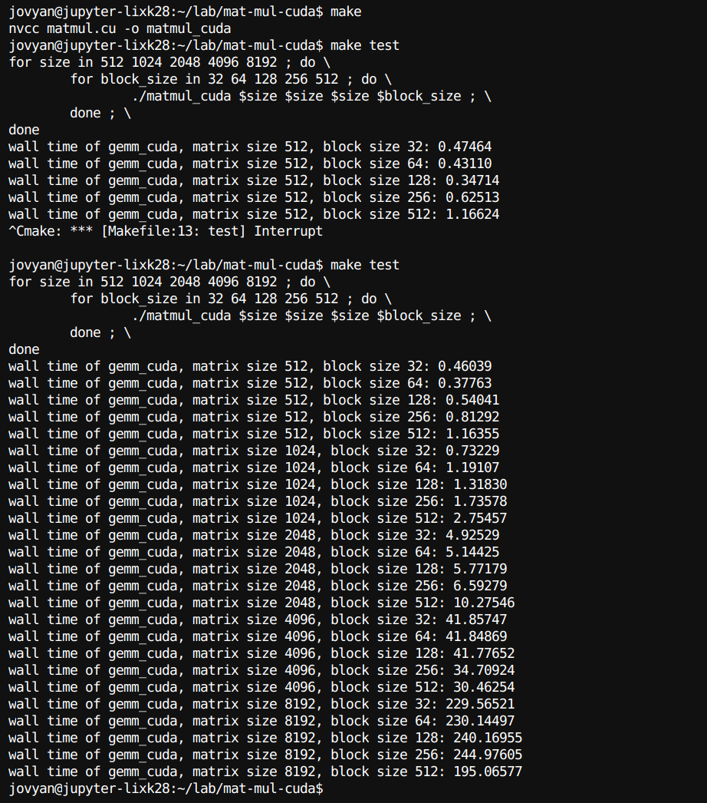

可以看到，我们对 grid 和 block 进行一维划分，在线程数一定的情况下，当矩阵规模较小时 ( <= 2048)，随着线程块大小增大，运行时间增加；而在矩阵规模较大时 ( >= 4096)，block size 增大会减少运行所需时间。

### (2) CUBLAS 矩阵乘法

设置 block size 为 32，即采用最大规模 (1024) 的线程块，矩阵规模从 512 增加到 8192。

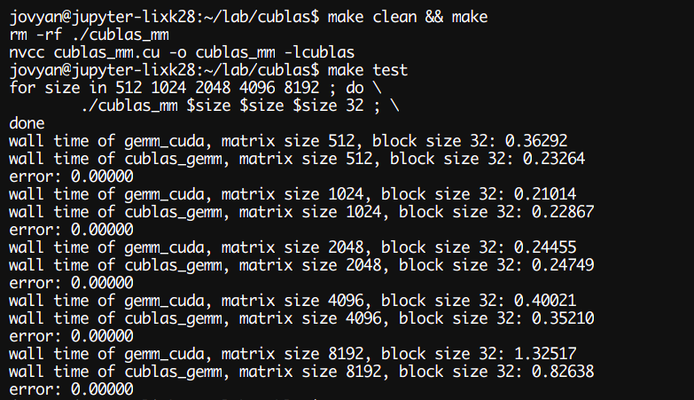

可以看出，在矩阵规模较小时 (<= 2048)，我们的 CUDA 矩阵乘法运行时间比 `cublasDgemm` 要快，但在矩阵规模较大时 (>= 4096)，我们的 CUDA 矩阵乘法要明显慢于 `cublasDgemm`。

一个改进方法是，通过 `__shared__` 关键字来定义一块共享内存，同一个线程块内的所有线程共享该内存区域。并使用 `__syncthreads()` 进行线程同步。每个线程块定义两块共享内存，一块用于缓存该线程块需要用到的 A 的部分，一块用于缓存需要用到的 B 的部分，这样将访存操作从多次的访问显存变为一次访问显存加上其余的访问线程块共享内存，减少了大量访存时间（because shared memory is much faster than global memory)。

### (3) CUDA 二维卷积

首先测试卷积结果的正确性。设置输入大小为 5x5，stride 分别是 1 和 2，block size 为 32。

可以看到，卷积结果正确（valid padding policy）。

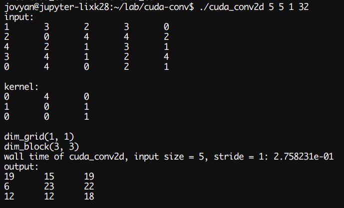

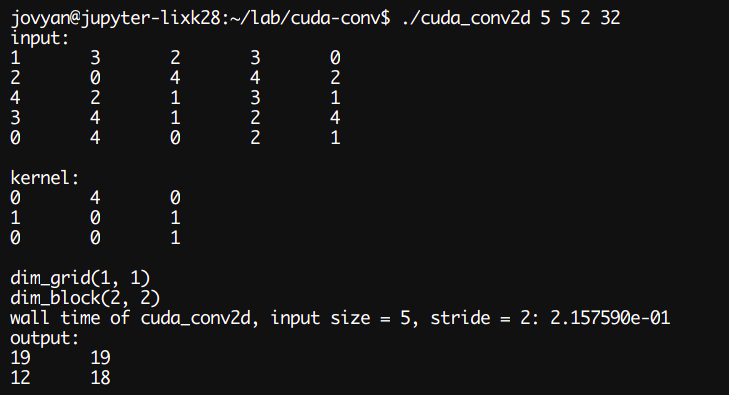

设置输入规模从 256 到 4096，步长分别为 1、2、3，运行时间如下。

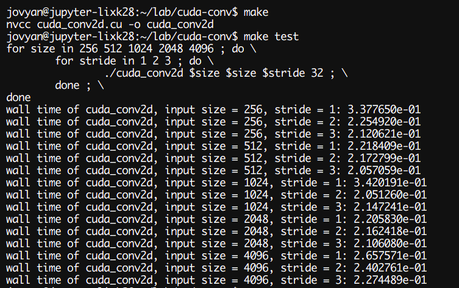

### (4) im2col 二维卷积

首先测试 im2col 操作和卷积结果的正确性。设置输入大小为 5x5，步长为 1 和 2。

可以看到，im2col 的重排结果正确，最后的卷积结果也正确（valid padding）。

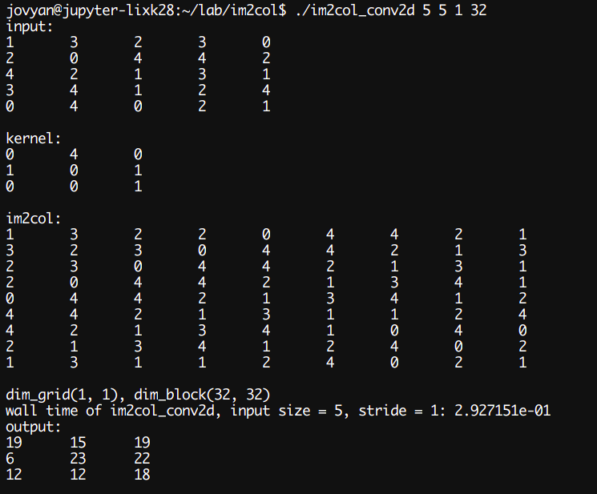

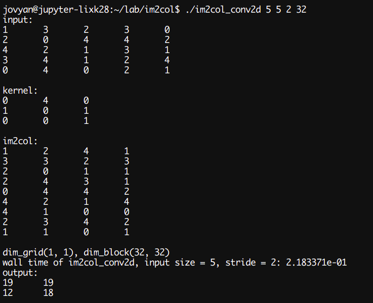

设置输入规模从 256 到 4096，步长分别为 1、2、3，运行时间如下。

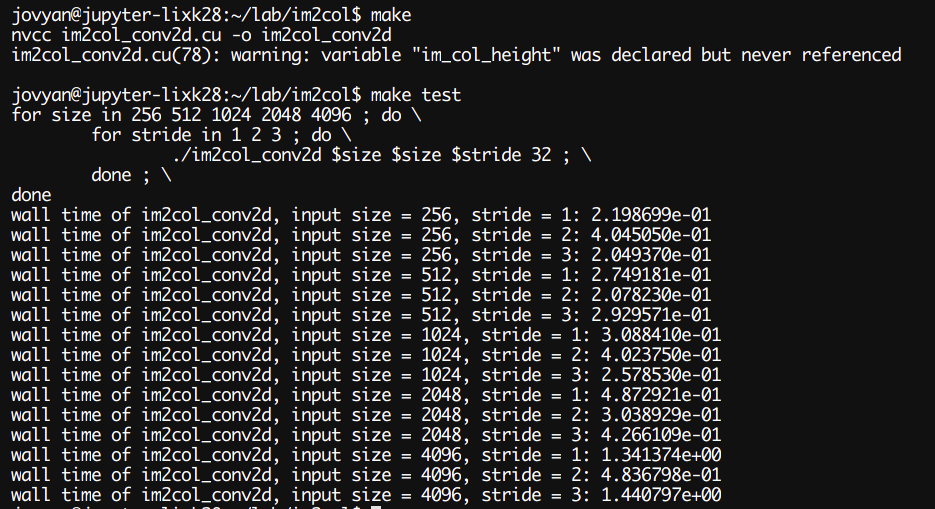

可以看到，运行时间明显比上面普通的二维卷积要慢，这是当矩阵规模增大时，im2col 的重排时间开销变大，而我们测试时的 batch size 为 1（即只有一张图片），主要的时间都花在 im2col 上了。

### (5) cuDNN 二维卷积

输入规模从 256 到 4096，步长从 1 到 3。分别记录两个时间，一个包括句柄、描述符等创建销毁的时间，另一个只记录做卷积运算的时间。

可以看出，卷积运算的速度非常快，但是句柄、描述符等创建销毁的开销非常大，导致每次完整的卷积操作都要 1 秒多。

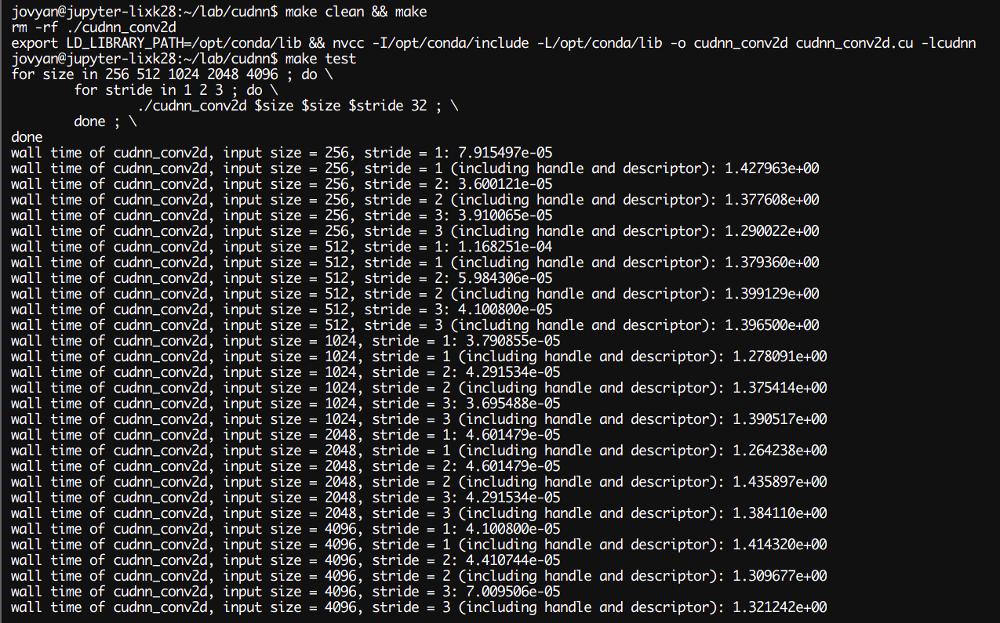

改进自己的 im2col + gemm 卷积：

- 使用共享内存：
  - gemm 可以使用共享内存进行优化，加速矩阵乘
- 优化浮点指令：
  - 使用 CUDA 提供的浮点向量指令，一次存取多个浮点数，从而减少访存次数
- im2col：
  - im2col 可以不用 CPU 完成，本身也非常容易并行，可以用封装一个 im2col 核函数，加速 im2col 过程

## (五) 实验感想

这次实验用 CUDA 实现了矩阵乘法，熟悉了基本的 CUDA 编程，CUDA gemm 速度非常快，让我真实体会到了 GPU 在向量化计算上的威力。

另外，学习了卷积的操作过程和原理，用 CUDA 自己编写了二维卷积，使用的是 valid padding，same padding 我没有想到优雅的解决办法，一个普通的想法是将原有图像复制到新的加了 padding 的矩阵中，但是这么做我觉得开销非常大，所以采用 valid padding，其实就是不 padding，舍弃掉卷积核无法卷积的部分。

还有，im2col 是卷积操作中常用的技术，我在 github 上找到了 caffe 的源码，caffe 中就是用 im2col 来做卷积运算，而且 caffe 是将 im2col 作为核函数的，这样加速了 im2col 的过程。  

调用和使用了 NVIDIA 深度学习和线性代数库函数，让我了解到已经有很成熟的库可以帮助我们做计算。

最后，虽然这是 HPC 最后一次实验，但这次实验内容非常有启发性，我在 github 上看到了一些深度学习框架比如 caffe，主要是卷积神经网络 CNN 的框架，因为 RNN 一般用 CPU 进行训练。

由于这学期太贪心选了太多可，下学期课比较少，我计划在寒假以及下学期的空余时间，自己从零开始实现一个 CNN 框架，进行一定程度的优化（比如针对嵌入式设备、移动设备使用 ARM 指令优化），在 MINIST 数据集上进行测试、与其他现有开源框架进行性能比较，并实际部署到硬件上（如树莓派），以后我就想做 HPC 方面的研究，为上层应用提供接口、优化应用性能。

## 附录：参考资料

- https://www.cnblogs.com/skyfsm/p/9673960.html
- https://docs.nvidia.com/cuda/cuda-c-programming-guide/
- https://cs.calvin.edu/courses/cs/374/CUDA/CUDA-Thread-Indexing-Cheatsheet.pdf
- https://www.cnblogs.com/feng9exe/p/6722990.html
- https://stackoverflow.com/questions/7989039/use-of-cudamalloc-why-the-double-pointer
- https://stackoverflow.com/questions/14595750/transpose-matrix-multiplication-in-cublas-howto
- https://www.cnblogs.com/cuancuancuanhao/p/7763256.html
- https://docs.nvidia.com/cuda/cublas/index.html#cublas-lt-t-gt-gemm
- https://stackoverflow.com/questions/56043539/cublassgemm-row-major-multiplication
- http://www.goldsborough.me/cuda/ml/cudnn/c++/2017/10/01/14-37-23-convolutions_with_cudnn/
- https://blog.csdn.net/ice__snow/article/details/79699388
- https://github.com/BVLC/caffe/blob/master/src/caffe/util/im2col.cu
- https://www.cnblogs.com/combfish/p/9259362.html
- https://docs.nvidia.com/deeplearning/cudnn/developer-guide/index.html
- https://docs.nvidia.com/deeplearning/cudnn/api/index.html#cudnnConvolutionForward